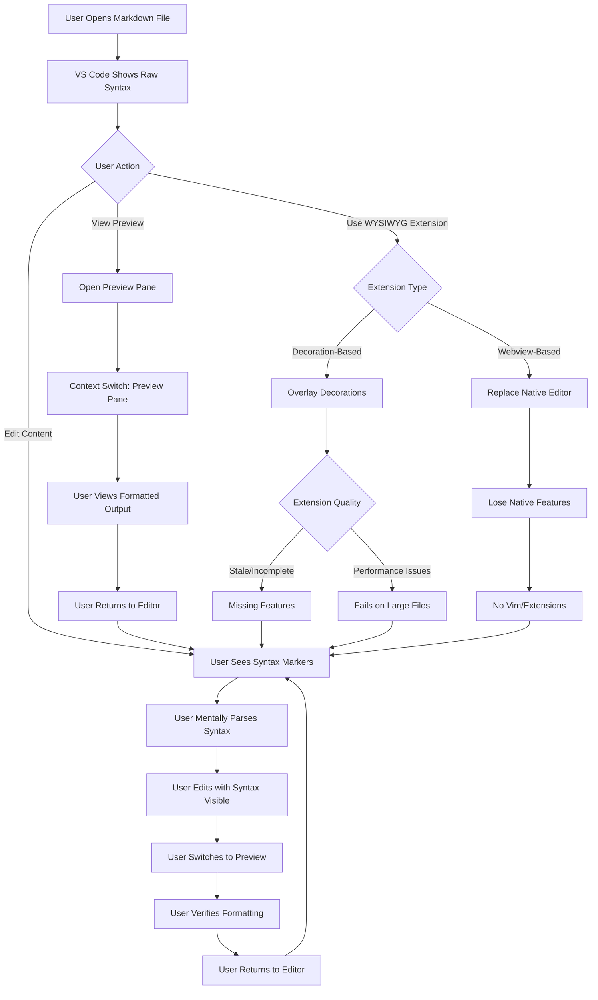

# Current State Process Flow

This diagram illustrates the current state of markdown editing in VS Code, showing user workflows, pain points, and extension limitations.

```mermaid
flowchart TD
    A[User Opens Markdown File] --> B[VS Code Shows Raw Syntax]
    B --> C{User Action}
    C -->|Edit Content| D[User Sees Syntax Markers]
    C -->|View Preview| E[Open Preview Pane]
    C -->|Use WYSIWYG Extension| F{Extension Type}
    D --> G[User Mentally Parses Syntax]
    G --> H[User Edits with Syntax Visible]
    H --> I[User Switches to Preview]
    I --> J[User Verifies Formatting]
    J --> K[User Returns to Editor]
    K --> D
    E --> L[Context Switch: Preview Pane]
    L --> M[User Views Formatted Output]
    M --> N[User Returns to Editor]
    N --> D
    F -->|Webview-Based| O[Replace Native Editor]
    F -->|Decoration-Based| P[Overlay Decorations]
    O --> Q[Lose Native Features]
    Q --> R[No Vim/Extensions]
    P --> S{Extension Quality}
    S -->|Stale/Incomplete| T[Missing Features]
    S -->|Performance Issues| U[Fails on Large Files]
    T --> D
    U --> D
    R --> D
```
