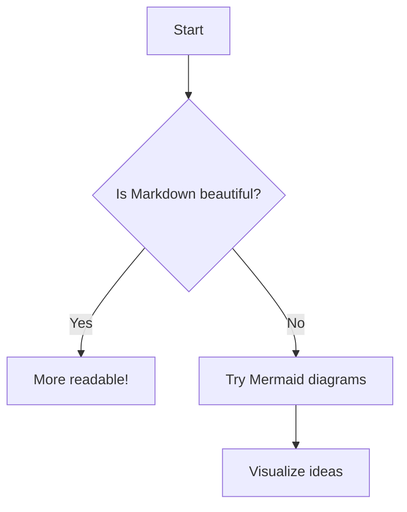
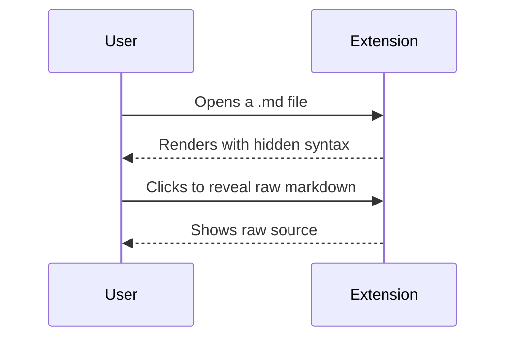
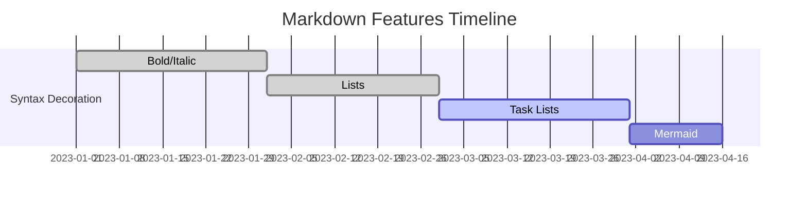

# Markdown Example

## Headings
# H1
## H2
### H3
...

## Text Formatting
**Bold** *Italic* `Code` ~~Strikethrough~~ 
***Bold & Italic*** **_Bold & Italic (nested)_** 
~~**Bold in Strikethrough**~~ **~~Bold and Strikethrough (nested)~~**
__GFM Bold__ _GFM Italic_

## Blockquote
> Quote
> > Nested Quote
> > > Nested² Quote

## Lists

- Unordered
  - Nested
  - - Mixed same indent
- 
* Also asterisk list
+ Plus unordered
    + Nested Plus
1. Ordered
2. Some other thing
   1. Nested Orders
3. 
4) GFM-parens

1. First item
2. Second item
2. Still second
3. Third item
4. 


- [x] Task done
- [ ] Todo italic *nested*
- [ ]    (task with spaces)
- [*] Not valid GFM (should not check)

## Edge Cases for GFM

### Task List Edge Cases
* [ ] Task with asterisk
- [] Missing space after bracket
- [x]Task missing space after checkbox
- [  ] Task with spaces in checkbox
1. [ ] Ordered task
2. [x]Another checked
1.   [ ] Multispaced numbering and box

### Table Edge Cases

| Multi<br>Line | Pipe&#124;In Cell | Escaped \| literal |
|--------------|-------------------|---------------------|
| a<br>b       | value\|2          | \| yes \|           |

| Empty Col |  | Trailing  |
|-----------|--|-----------|
| 1         |  | trailing  |

| A | :--- | ---: | :-: |
|---|------|------|-----|
| L | left |   r  | c   |

| Inline <sub>HTML</sub> | **Bold** | `Code`   |
|:----------------------:|---------:|:--------:|
|       Some             |   **Row**|  `Data`  |

### Code/HTML Edge Cases

`fenced` `backticks` `` ` with `` inside ``

<pre>
* GFM allows HTML *in text*
</pre>

## Code Block (fence variations)
```python
print("Hello, World!")
```

~~~js
console.log("Tilde fence, GFM");
~~~

    Indented code block

## Table
| A | B |
|---|---|
| X | Y |

## Autolink Edge Cases

<https://github.com>
www.example.com
user@example.com

## Strikethrough Edge (GFM only)
~not strikethrough~
~~GFM strikethrough~~
foo~~bar~~baz

## Emoji
:smile: :+1: :tada: :not-an-emoji:

## Mention-style (@user, #123)

@octocat #42 repo#99

## Mermaid Charts








