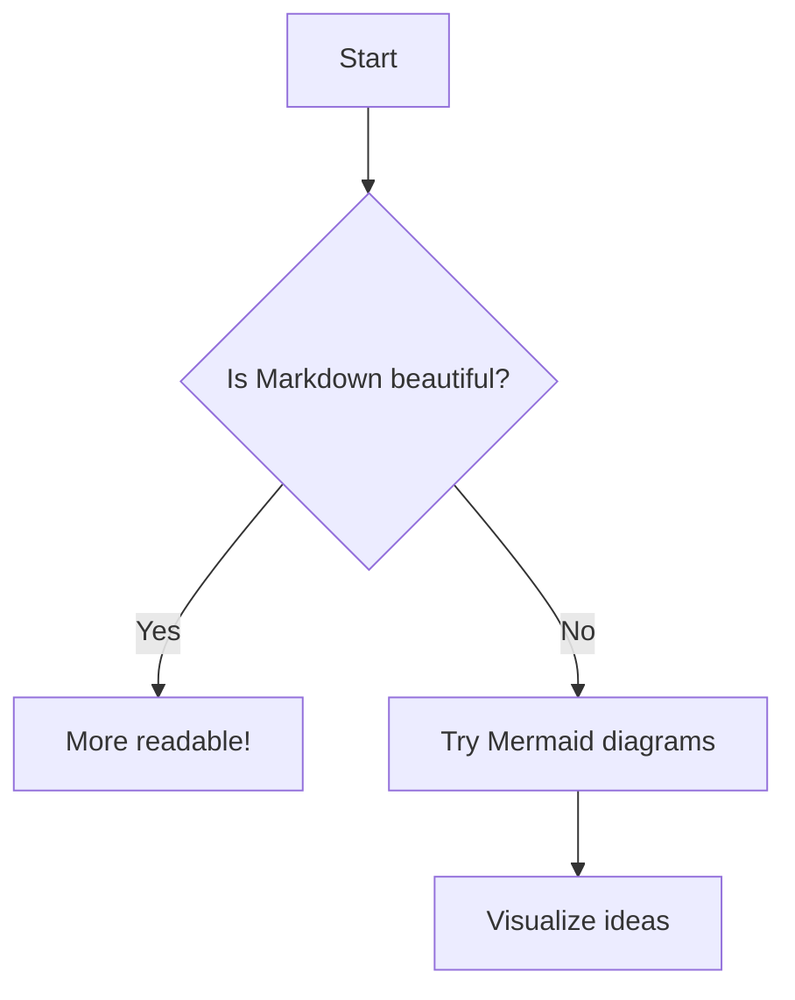
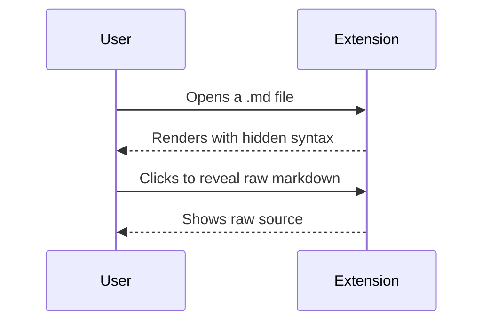
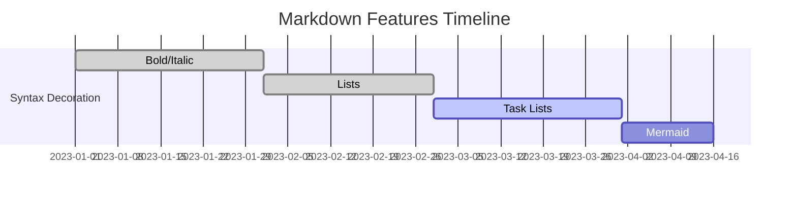

# Markdown Example

---

## Font Styles

**Bold text with asterisks**
__Bold text with underscores__

*Italic text with asterisk*
_Italic text with underscore_

***Bold and italic text with triple asterisks***
___Bold and italic text with triple underscores___

~~Strikethrough text~~
`simple inline code`

`code with spaces`

`` `code` with backticks inside ``
````Here is some ``inline `code` inside backticks````

`` ``Use \`backticks\` literally`` ``


## Sequential Font Styles Examples

**Bold** *Italic* ~~Strikethrough~~
__Bold__ _Italic_ `Inline code`
**Bold** *Italic* ~~Strikethrough~~ `Code`
~~Strikethrough~~ **Bold** *Italic*
*Italic* `Code` __Bold__
`Code` ~~Strikethrough~~ *Italic*
**Bold** *Italic* ~~Strikethrough~~ `Code block`
[**Bold link**](https://example.com) *Italic* `inline code`
~~Strikethrough~~ [__Bold link__](https://example.com) *Italic* `Code`

---

## Nested Combinations

**Bold with *italic* inside**
*Italic with **bold** inside*
***Bold and italic combined***
**_Bold and italic (nested underscore syntax)_**

~~**Bold in strikethrough**~~
~~*Italic in strikethrough*~~
**~~Bold and strikethrough (nested)~~**
**~~Bold, Italic, and Strikethrough, and then `code`~~_**

[**Bold** link text](https://example.com)
[*Italic* link text](https://example.com)
[~~Strikethrough~~ link text](https://example.com)
[`Code` in link text](https://example.com)
[**Bold** and *italic* combined](https://example.com)


`**bold** inside code` (should show literal asterisks)
`*italic* inside code` (should show literal asterisks)
`~~strikethrough~~ inside code` (should show literal tildes)

---

## Stacked Markdown Styles

# H1 with **bold** text

## H2 with *italic* text

### H3 with ~~strikethrough~~ text

#### H4 with `inline code`

##### H5 with [link text](https://example.com)

###### H6 with **bold** and *italic* combined

- Item with **bold** text
- Item with *italic* text
- Item with ~~strikethrough~~ text
- Item with `inline code`
- Item with [link](https://example.com)

* Item with **bold** and *italic*
* Item with `code` and [link](https://example.com)

+ Item with **bold** text
+ Item with *italic* text

- Parent item with **bold**
  - Nested item with *italic*
    - Deeply nested with `code`
- Another parent
  - Nested with [link](https://example.com)

- Item
- - Nested item

1. First item with **bold** text
2. Second item with *italic* text
3. Third item with ~~strikethrough~~ text
4. Fourth item with `inline code`
5. Fifth item with [link](https://example.com)

1) First item with **bold**
2) Second item with *italic*
3) Third item with `code`

10. Tenth item with **bold**
11. Eleventh item with *italic*
12. Twelfth item with [link](https://example.com)

1. Parent item
   1. Nested item
      1. Deeply nested item
2. Another parent

- [x] Completed task with **bold** text
- [ ] Unchecked task with *italic* text
- [ ] Task with `inline code`
- [ ] Task with [link](https://example.com)

* [x] Completed task with **bold**
* [ ] Unchecked task with *italic*

+ [x] Completed task
+ [ ] Unchecked task with `code`

1. [x] Completed ordered task with **bold**
2. [ ] Unchecked ordered task with *italic*
3. [x] Another completed task with `code`

1) [x] Completed task
2) [ ] Unchecked task with **bold**

> Quote text with **bold** formatting

> Quote text with *italic* formatting

> Quote text with `inline code`

> Quote text with [link](https://example.com)

> Outer quote with **bold**
> > Nested quote with *italic*
> > > Deeply nested quote with `code`

---
***
___

-------
********

--
**
__

---

## Code Blocks

```python
print("Hello, World!")
def example():
    return True
```

```
plain code block
no language specified
```

````markdown
Here is some ```code``` inside
And also ``inline `code` `` examples
````

```javascript
function hello() {
  console.log("Hello, World!");
}
```

---

## Basic Markdown Smoke Test

# Document Title

This is a paragraph with **bold**, *italic*, ~~strikethrough~~, `inline code`, and a [link to example.com](https://example.com).

## Section Heading

Here's an image: 

- Unordered list item 1
- Unordered list item 2 with **bold**
  - Nested item with *italic*

1. Ordered list item 1
2. Ordered list item 2 with `code`
3. Ordered list item 3 with [link](https://example.com)

- [x] Completed task
- [ ] Unchecked task

> This is a blockquote with **bold** text
> > Nested blockquote with *italic* text

---

```python
# Code block example
def example():
    return "Hello, World!"
```

---

## Math (LaTeX) — TODO

```latex
\begin{align}
E &= mc^2 \\[10pt]
a^2 + b^2 &= c^2 \\[10pt]
\int_0^\infty e^{-x^2} \, dx &= \frac{\sqrt{\pi}}{2} \\[18pt]
\text{Euler's Identity:} \quad e^{i\pi} + 1 &= 0 \\[10pt]
\text{Quadratic Formula:} \quad x &= \frac{ -b \pm \sqrt{b^2 - 4ac} }{2a} \\[18pt]
\text{Taylor Series for } e^x: \quad e^x &= \sum_{n=0}^{\infty} \frac{x^n}{n!}
\end{align}
```

```math
\sum_{n=1}^{\infty} \frac{1}{n^2} = \frac{\pi^2}{6}
```

- Euler's identity: $e^{i\pi} + 1 = 0$
- Physics: Force $F = ma$, Greek: $A = \pi r^2$
- Function: $ f(x)=\int_{-\infty}^{\infty}e^{-x^2}dx $

$$
f(x) = \int_{-\infty}^{\infty} e^{-x^2} dx
$$

**Note:** Use `\$` for a regular dollar sign when math is implemented.

---

## Appendix: TODO / Not Implemented Yet

| A | B |
|---|---|
| X | Y |

| A | :--- | ---: | :-: |
|---|------|------|-----|
| L | left | r | c |

| Inline <sub>HTML</sub> | **Bold** | `Code` |
|:----------------------:|---------:|:--------:|
| Some | **Row**| `Data` |

| Multi<br>Line | Pipe&#124;In Cell | Escaped \| literal |
|--------------|-------------------|---------------------|
| a<br>b | value\|2 | \| yes \| |
| Empty Col | | Trailing |

<https://github.com>
www.example.com
user@example.com

:smile: :+1: :tada: :not-an-emoji:

@octocat #42 repo#99







~~~js
console.log("Tilde fence, GFM");
~~~

<pre>
* GFM allows HTML *in text*
</pre>

- [] Missing space after bracket (invalid)
- [x]Task missing space after checkbox (invalid)
- [*] Not valid GFM (should not check)

~not strikethrough~ (single tilde, not valid)
~~GFM strikethrough~~ (valid)
foo~~bar~~baz (strikethrough in middle of word)
