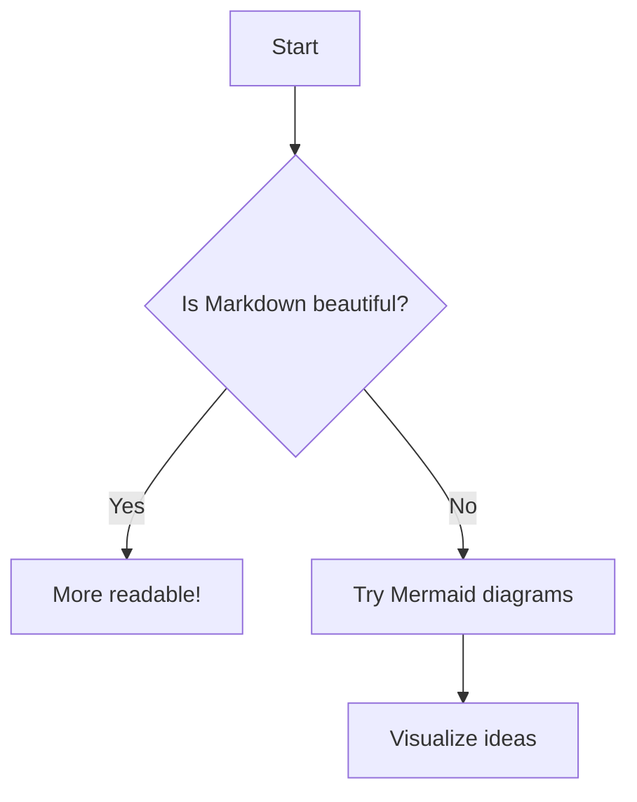
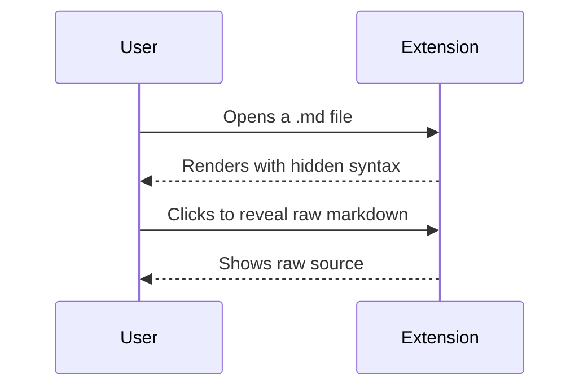
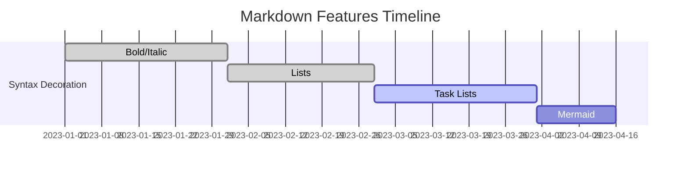

# Markdown Example
## Headings
# H1
## H2
### H3
...
## Lists **lorem ipsum** ***dolor sit amet*** 
## Text Formatting **bold** ***cursiv*** jiofjsd
**Bold** *Italic* `Code` ~~Strikethrough~~
***Bold & Italic*** **_Bold & Italic (nested)_**
~~**Bold in Strikethrough**~~ **~~Bold and Strikethrough (nested)~~**
__GFM Bold__ _GFM Italic_
**~~Bold, Italic, and Strikethrough, and then `code`~~_**
**bold**, ***italic***, ~~strikethrough~~, `code`
# **bold**, ***italic***, ~~strikethrough~~, `code`
To create strikethrough text in Markdown or GitHub Flavored Markdown (GFM), wrap the text you want to strike through with double tildes `~~like this~~`:
Example:  
~~strikethrough~~
Result:  
~~strikethrough~~
## Blockquote
> Quote
> > Nested Quote
> > > Nested² Quote
## Lists
- Unordered
- Nested
- - Mixed same indent
-
* Also asterisk list
+ Plus unordered
+ 
+ Nested Plus
1. Ordered
2. Some other thing
3. Nested Orders
3.
4) GFM-parens
5. First item
6. Second item
7. Still second
8. Third item
4.
- [x] Task done
- [ ] Todo italic *nested*
- [ ] (task with spaces)
- [*] Not valid GFM (should not check)
Here are examples of inline code in Markdown:
- ``This is a simple `inline code` example.``
- You can use backticks for code, like `` `print('Hello')` ``.
- Inline code with surrounding text: I love using the `` `map()` `` function in JavaScript.
- Escaping backticks: `` ``Use \`backticks\` literally`` ``
- Multiple backticks for nested backtick content: ````Here is some ``inline `code` inside backticks````
## LaTeX Fenced Block Example
You can include LaTeX in a fenced code block with `math` or `latex`:
```latex
\begin{align}
E &= mc^2 \\[10pt]
a^2 + b^2 &= c^2 \\[10pt]
\int_0^\infty e^{-x^2} \, dx &= \frac{\sqrt{\pi}}{2} \\[18pt]
\text{Euler's Identity:} \quad e^{i\pi} + 1 &= 0 \\[10pt]
\text{Quadratic Formula:} \quad x &= \frac{ -b \pm \sqrt{b^2 - 4ac} }{2a} \\[18pt]
\text{Taylor Series for } e^x: \quad e^x &= \sum_{n=0}^{\infty} \frac{x^n}{n!}
\end{align}
```
You can also nest block math with double dollars:
$$
f(x) = \int_{-\infty}^{\infty} e^{-x^2} dx
$$
some text and some function $ f(x)=\int_{-\infty}^{\infty}e^{-x^2}dx $
Or with a block:
```math
\sum_{n=1}^{\infty} \frac{1}{n^2} = \frac{\pi^2}{6}
```
## Inline Math Example
Inline math uses single `$` delimiters, e.g.:
- `Euler's identity: $e^{i\pi} + 1 = 0$` → Euler's identity: $e^{i\pi} + 1 = 0$
- Physics: `Force $F = ma$`, Greek: `$A = \pi r^2$`
**Note:** Use `\$` for a regular dollar sign.
_Code:_
```
Total cost is \$5, calculated as $2 + 3 = 5$.
```
## Edge Cases for GFM
### Task List Edge Cases
* [ ] Task with asterisk
- [] Missing space after bracket
- [x]Task missing space after checkbox
- [ ] Task with spaces in checkbox
1. [ ] Ordered task
2. [x]Another checked
3. [ ] Multispaced numbering and box
### Table Edge Cases
| Multi<br>Line | Pipe&#124;In Cell | Escaped \| literal |
|--------------|-------------------|---------------------|
| a<br>b | value\|2 | \| yes \| |
| Empty Col | | Trailing |
|-----------|--|-----------|
| 1 | | trailing |
| A | :--- | ---: | :-: |
|---|------|------|-----|
| L | left | r | c |
| Inline <sub>HTML</sub> | **Bold** | `Code` |
|:----------------------:|---------:|:--------:|
| Some | **Row**| `Data` |
### Code/HTML Edge Cases
`fenced` `backticks` `` ` with `` inside ``
<pre>
* GFM allows HTML *in text*
</pre>
## Code Block (fence variations)
```python
print("Hello, World!")
```
~~~js
console.log("Tilde fence, GFM");
~~~
Indented code block
## Table
| A | B |
|---|---|
| X | Y |
## Autolink Edge Cases
<https://github.com>
www.example.com
user@example.com
## Strikethrough Edge (GFM only)
~not strikethrough~
~~GFM strikethrough~~
foo~~bar~~baz
## Emoji
:smile: :+1: :tada: :not-an-emoji:
## Mention-style (@user, #123)
@octocat #42 repo#99
## Mermaid Charts


