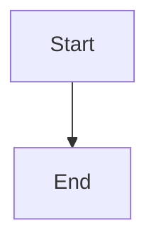

# Mermaid Diagrams

## Overview

Inline SVG rendering for Mermaid diagrams in code blocks with hover preview support for large diagrams.

## Implementation

- **Detection**: Detects ` ```mermaid` code blocks during markdown parsing
- **Rendering**: Renders SVG inline using VS Code decorations with data URIs
- **Hover Preview**: Shows larger preview on hover with optimized SVG processing for large diagrams
- **Error Handling**: Graceful error handling with informative error messages
- **Theme Support**: Automatically adapts to VS Code theme (light/dark)
- **Performance**: Caching and bounded parallelism for rendering
- **SVG Optimization**: Aggressive optimization for large diagrams (path simplification, precision reduction, content optimization)
- **Dimension Capping**: Limits hover preview size to reduce SVG complexity
- **Dual Encoding**: URL encoding with Base64 fallback for large SVGs

## Acceptance Criteria

### Basic Mermaid Diagrams
```gherkin
Feature: Mermaid diagram formatting

  Scenario: Basic diagram
    When I type ```mermaid
    And I type graph TD
    And I type     A --> B
    And I type ```
    Then the code block is detected
    And the rendered diagram appears inline

  Scenario: Different diagram types
    When I type ```mermaid
    And I type sequenceDiagram
    And I type ```
    Then the diagram is detected correctly
```

### Edge Cases
```gherkin
Feature: Mermaid diagram edge cases

  Scenario: Invalid Mermaid syntax
    When I type ```mermaid
    And I type invalid syntax
    And I type ```
    Then the error is handled gracefully
    And the raw mermaid text remains visible

  Scenario: Non-mermaid code block
    When I type ```javascript
    And I type code
    And I type ```
    Then it is not treated as Mermaid
```

### Reveal Raw Markdown
```gherkin
Feature: Reveal Mermaid diagram

  Scenario: Reveal on select
    Given ```mermaid
    graph TD
    A --> B
    ``` is in my file
    When I select the code block
    Then the raw markdown is shown
    And the rendered diagram is hidden
    When I deselect
    Then the rendered diagram appears again
```

## Notes

- ✅ **Implemented**: Full inline rendering with hover preview support
- Uses local Mermaid library (bundled with extension)
- SVG rendering via Node.js with JSDOM
- Comprehensive error handling and optimization
- Theme-aware rendering (light/dark mode support)
- Performance optimizations for large diagrams
- See [ADR: Mermaid Diagram Hover Rendering](../architecture/ADR/mermaid.md) for implementation details
- See [Mermaid Rendering Findings](../mermaid-rendering-findings.md) for technical details

## Examples

````markdown

````

→ Rendered diagram appears inline (raw markdown hidden when not editing)
