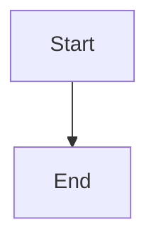

# Mermaid Diagrams

**Status:** ✅ Implement / Improve  
**Priority:** High  
**Category:** Core GFM - Must Have

## Overview

Hover preview for rendered Mermaid diagrams in code blocks.

## Details

- **Feasibility:** Moderate
- **Usefulness:** High
- **Risk:** Medium (rendering complexity)
- **Effort:** 2-3 weeks

## Implementation

Detect ` ```mermaid` code blocks, render on hover using hover provider (better than markless inline approach).

## Dependencies

Rendering solution required (to be determined)

## Notes

- High user demand
- Competitive requirement (markless has it but buggy)
- Hover approach avoids markless bugs
- Better performance than inline rendering
- Simpler and more reliable than inline approach

## Examples

````markdown

````

→ Hover over code block to see rendered diagram
