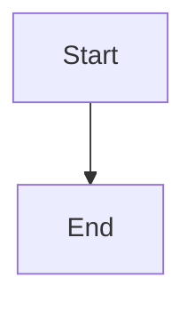

# Mermaid Diagrams

## Overview

Inline SVG rendering for Mermaid diagrams in code blocks.

## Implementation

Detect ` ```mermaid` code blocks, render SVG inline using decorations (no hover).

## Acceptance Criteria

### Basic Mermaid Diagrams
```gherkin
Feature: Mermaid diagram formatting

  Scenario: Basic diagram
    When I type ```mermaid
    And I type graph TD
    And I type     A --> B
    And I type ```
    Then the code block is detected
    And the rendered diagram appears inline

  Scenario: Different diagram types
    When I type ```mermaid
    And I type sequenceDiagram
    And I type ```
    Then the diagram is detected correctly
```

### Edge Cases
```gherkin
Feature: Mermaid diagram edge cases

  Scenario: Invalid Mermaid syntax
    When I type ```mermaid
    And I type invalid syntax
    And I type ```
    Then the error is handled gracefully
    And the raw mermaid text remains visible

  Scenario: Non-mermaid code block
    When I type ```javascript
    And I type code
    And I type ```
    Then it is not treated as Mermaid
```

### Reveal Raw Markdown
```gherkin
Feature: Reveal Mermaid diagram

  Scenario: Reveal on select
    Given ```mermaid
    graph TD
    A --> B
    ``` is in my file
    When I select the code block
    Then the raw markdown is shown
    And the rendered diagram is hidden
    When I deselect
    Then the rendered diagram appears again
```

## Notes

- High user demand
- Competitive requirement (markless has it but buggy)
- Local rendering required (no CDN)
- Rendering solution required (Node + JSDOM)
- Feasibility: Moderate
- Usefulness: High
- Risk: Medium (rendering complexity)
- Effort: 2-3 weeks
- Rendering solution required (to be determined)

## Examples

````markdown

````

→ Rendered diagram appears inline (raw markdown hidden when not editing)
