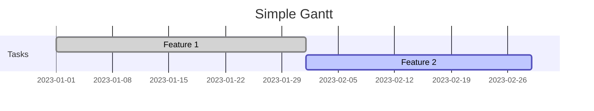

# Mermaid Gantt Chart Rendering Findings

## Problem Summary

Gantt charts rendered by Mermaid display incorrectly with:
- Zero-width `viewBox` (e.g., `viewBox="0 0 0 148"`)
- Negative element widths (e.g., `width="-79"`, `width="-71"`)
- Negative x-coordinates (e.g., `x="-4"`, `x="-9"`)
- Broken geometry (negative path coordinates, misaligned elements)

Other Mermaid diagram types (flowcharts, sequence diagrams) render correctly.

## Hypothesis

**Root Cause**: Gantt charts are layout/measurement-dependent. When the webview has zero layout width during rendering, Mermaid's d3 scale computes a broken range `[0, 0]`, producing invalid geometry.

**Why Only Gantt?**: 
- Gantt charts use time-based d3 scales that require container width to map dates → pixels
- Other diagrams use node-based layouts (graph algorithms) that don't depend on container width

## Verification Implementation

Added layout metrics logging to capture webview dimensions before `mermaid.render()`:

### Metrics Captured

- `visibilityState` - Document visibility state
- `hidden` - Whether document is hidden
- `windowInnerWidth` / `windowInnerHeight` - Window dimensions
- `documentElementClientWidth` / `documentElementClientHeight` - Document element dimensions
- `bodyClientWidth` / `bodyClientHeight` - Body element dimensions
- `bodyRectWidth` / `bodyRectHeight` - Body bounding rect
- `documentElementRectWidth` / `documentElementRectHeight` - Document element bounding rect
- `probeRectWidth` / `probeRectHeight` - Offscreen probe div with explicit 2000px width

### Implementation Details

**Location**: `src/mermaid/mermaid-renderer.ts`

1. **Webview-side logging** (lines 48-82): `measureLayout()` function captures all metrics
2. **Gantt-specific trigger** (lines 105-114): Only logs for gantt diagrams
3. **Extension-side storage** (line 23): Stores in `lastGanttLayoutMetrics`
4. **HTML output** (line 799): Metrics included in saved HTML files for verification

## Verification Results

### Test Case: Simple Gantt Chart

**Source**:


**Layout Metrics Captured** (from `mermaid-683a3d63-1769210476526.html`):

```json
{
  "visibilityState": "visible",
  "hidden": false,
  "windowInnerWidth": 0,                    // ⚠️ ZERO
  "windowInnerHeight": 0,                   // ⚠️ ZERO
  "documentElementClientWidth": 0,           // ⚠️ ZERO
  "documentElementClientHeight": 0,          // ⚠️ ZERO
  "bodyClientWidth": 40,                     // Small (padding only)
  "bodyClientHeight": 0,                     // ⚠️ ZERO
  "bodyRectWidth": 40,
  "bodyRectHeight": 0,                       // ⚠️ ZERO
  "documentElementRectWidth": 0,             // ⚠️ ZERO
  "documentElementRectHeight": 0,            // ⚠️ ZERO
  "probeRectWidth": 2000,                    // ✅ Probe works (explicit width)
  "probeRectHeight": 1
}
```

### Key Findings

1. **Webview has zero layout dimensions**:
   - `windowInnerWidth: 0` - Window reports zero width
   - `documentElementClientWidth: 0` - Document element has zero width
   - Despite `visibilityState: "visible"` and `hidden: false`

2. **Probe div confirms layout capability**:
   - `probeRectWidth: 2000` - Elements with explicit width CAN have width
   - This proves the issue is container measurement, not CSS rendering

3. **Mermaid uses zero-width measurements**:
   - Mermaid likely calls `window.innerWidth` or `document.documentElement.clientWidth`
   - Both return `0`, causing d3 scale to compute range `[0, 0]`
   - This produces negative widths/positions when mapping dates to pixels

4. **Post-processing fixes viewBox but not geometry**:
   - Our `processSvg()` fixes `viewBox="0 0 0 148"` → `viewBox="0 0 600 148"`
   - But underlying geometry remains broken (negative widths, negative x positions)
   - This confirms geometry is computed at render-time, not fixable post-render

### Evidence of Broken Geometry

Even after viewBox fix, the SVG still contains:

- **Negative widths**: `width="-79"`, `width="-71"`, `width="-37.5"`
- **Negative x positions**: `x="-4"`, `x="-9"`
- **Negative path coordinates**: `d="M0,-63V0H-150V-63"` (H-150 = horizontal line going -150px left)
- **Extreme negative coordinates**: `x1="-2770"` (today line)

## Root Cause Analysis

### Webview Lifecycle Issue

**Code Location**: `src/mermaid/mermaid-renderer.ts` lines 256-263

```typescript
// Open the mermaid view briefly to initialize it, then switch back
vscode.commands.executeCommand('mdInline.mermaidRenderer.focus')
  .then(() => {
    // Switch back to explorer after a brief moment
    setTimeout(() => {
      vscode.commands.executeCommand('workbench.view.explorer');
    }, 100);
  });
```

**Problem**: 
- Webview is opened briefly, then switched away after 100ms
- `retainContextWhenHidden: true` (line 252) keeps JavaScript context but layout collapses
- When hidden, `window.innerWidth` and `document.documentElement.clientWidth` become `0`
- Subsequent gantt renders happen while webview has zero layout width

### Why Other Diagrams Work

- **Flowcharts/Sequence Diagrams**: Use graph layout algorithms (dagre, etc.) that compute positions based on node relationships, not container width
- **Gantt Charts**: Use d3 time scales that require container width to map date ranges to pixel positions

## Solution Approaches

### Option 1: Ensure Webview Has Layout Width (Recommended)

**Approach**: Keep webview visible or ensure it has layout width when rendering gantt charts.

**Implementation**:
- Delay switching away from webview until after gantt rendering completes
- OR: Render gantt into a container with explicit pixel width (even if offscreen with `visibility:hidden`, not `display:none`)

### Option 2: Pass Explicit Width to Mermaid

**Approach**: If Mermaid supports explicit width configuration, pass it during initialization.

**Implementation**: Check Mermaid API for width/container size options in `mermaid.initialize()` or `mermaid.render()`.

### Option 3: Render in Visible Container

**Approach**: Create a temporary visible container for gantt rendering, then hide it.

**Implementation**: 
- Create offscreen div with explicit width (e.g., `2000px`)
- Use `visibility: hidden` (not `display: none`) to maintain layout
- Render into this container
- Extract SVG and dispose container

## Current Workarounds

### ViewBox Fix (Partial)

**Location**: `src/mermaid/mermaid-renderer.ts` lines 426-471

- Detects zero-width viewBox: `viewBox="0 0 0 148"`
- Fixes to: `viewBox="0 0 600 148"` (using 3:1 aspect ratio minimum)
- **Limitation**: Fixes viewBox but cannot fix underlying broken geometry (negative widths, positions)

### Aspect Ratio Scaling

**Location**: `src/mermaid/mermaid-renderer.ts` lines 473-520

- Calculates width from aspect ratio: `width = (viewBoxWidth / viewBoxHeight) * height`
- Sets explicit width/height attributes
- Maintains aspect ratio for both wide and tall charts
- **Limitation**: Works for valid SVGs but cannot fix broken geometry from zero-width render

## Next Steps

1. **Implement Option 1 or 3**: Ensure webview/container has non-zero width during gantt rendering
2. **Test**: Verify gantt charts render with correct geometry (no negative widths/positions)
3. **Remove workarounds**: Once root cause is fixed, viewBox fix may no longer be needed
4. **Monitor**: Keep layout metrics logging to catch regressions

## Files Modified

- `src/mermaid/mermaid-renderer.ts` - Added layout metrics logging and HTML output
- `src/test/__mocks__/vscode.ts` - Added `lineAt()` method to mock for tests
- `src/decorator/__tests__/decorator-mermaid.test.ts` - Updated mocks for new exports

## References

- **Saved HTML Files**: `docs/docs/uat/mermaid/mermaid-*.html` - Contain layout metrics and rendered SVGs
- **Test Gantt Source**: `docs/uat/mermaid/gantt.md`
- **Verification Log**: Check VS Code Developer Console for `[Mermaid Renderer] Webview debug:` messages

## Date

2026-01-23
