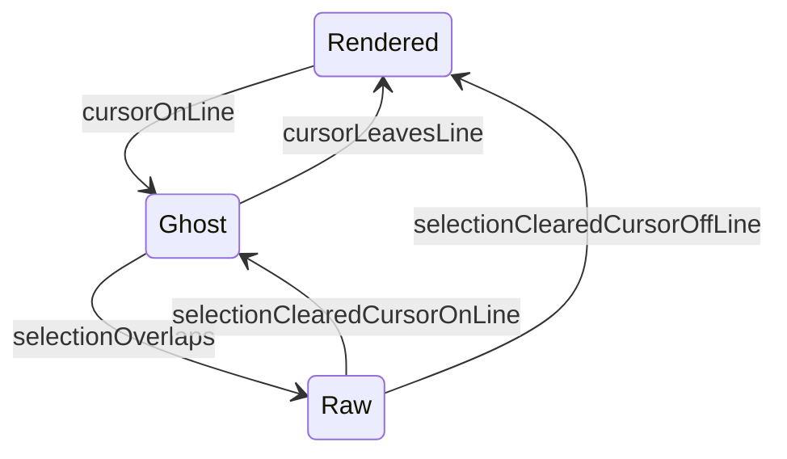

# Syntax Shadowing Behavior: Review & Improvement Variants

## What the draft document proposes (and what’s valuable)

The strategic idea in [docs/marketing-strategy.md](../marketing-strategy.md) is directionally strong:

- **Make syntax “recede”** so users read meaning, not punctuation.
- **Three UX states**: rendered (syntax hidden), focused (syntax “ghosted”), selected (raw).
- **“Semantic decorators”**: syntax (including HTML) should drive visual semantics on the wrapped content.

This is a good north star, but it needs to be reconciled with how the extension currently works and with what VS Code decorations can/can’t do.

## Ground truth: how syntax shadowing works today

Two current behaviors define today’s “shadowing”:

- **Line-based raw reveal**: if the cursor is on a line (even with an empty selection), *all* decorations for ranges on that line are skipped.

  ```typescript title="src/decorator.ts#L550-L623"
  /**
   * Filters decorations based on current selections and groups by type.
   *
   * @private
   * @param {DecorationRange[]} decorations - Decorations to filter
   * @param {string} originalText - Original document text (for offset adjustment)
   * @returns {Map<DecorationType, Range[]>} Filtered decorations grouped by type
   */
  private filterDecorations(decorations: DecorationRange[], originalText: string): Map<DecorationType, Range[]> {
    if (!this.activeEditor) {
      return new Map();
    }

    // Pre-compute selected line ranges for O(1) lookups
    const selectedLines = new Set<number>();
    const selectedRanges: Range[] = [];
    const cursorPositions: Position[] = [];

    for (const selection of this.activeEditor.selections) {
      // Add all lines in the selection to the set
      for (let line = selection.start.line; line <= selection.end.line; line++) {
        selectedLines.add(line);
      }
      // Store non-empty selections for precise range intersection checks
      if (!selection.isEmpty) {
        selectedRanges.push(selection);
      } else {
        // Store cursor positions for checkbox exclusion check
        cursorPositions.push(selection.start);
      }
    }

    // Group decorations by type using Map
    const filtered = new Map<DecorationType, Range[]>();

    for (const decoration of decorations) {
      const range = this.createRange(decoration.startPos, decoration.endPos, originalText);
      if (!range) continue;

      // Special handling for checkbox decorations:
      // - Keep checkbox visible when clicking on it (for toggle functionality)
      // - Show raw markdown when clicking elsewhere on the line
      const isCheckbox = decoration.type === 'checkboxChecked' || decoration.type === 'checkboxUnchecked';

      if (isCheckbox) {
        // Check if cursor is within the checkbox range - if so, keep it visible
        const cursorInCheckbox = cursorPositions.some(pos =>
          pos.line === range.start.line &&
          pos.character >= range.start.character &&
          pos.character <= range.end.character
        );

        if (cursorInCheckbox) {
          // Keep checkbox visible when clicking on it
          const ranges = filtered.get(decoration.type) || [];
          ranges.push(range);
          filtered.set(decoration.type, ranges);
          continue;
        }
      }

      // For all decorations (including checkboxes when cursor is not on them):
      // Hide to show raw markdown when selection overlaps or cursor is on the line
      if (this.isRangeSelected(range, selectedRanges) || this.isLineOfRangeSelected(range, selectedLines)) {
        continue;
      }

      // Add to appropriate type array
      const ranges = filtered.get(decoration.type) || [];
      ranges.push(range);
      filtered.set(decoration.type, ranges);
    }

    return filtered;
  }
  ```

- **Markers are usually removed from layout**: the default “hide” decoration uses `display: none`, which makes the decorated view compact but causes layout shifts whenever the raw syntax reappears.

  ```typescript title="src/decorations.ts#L24-L33"
  export function HideDecorationType() {
    return window.createTextEditorDecorationType({
      // Hide the item
      textDecoration: 'none; display: none;',
      // This forces the editor to re-layout following text correctly
      after: {
        contentText: '',
      },
    });
  }
  ```

A key nuance: the parser currently emits **one bucket** (`type: 'hide'`) for many different kinds of hidden things.

```typescript title="src/parser.ts#L261-L291"
private addMarkerDecorations(
  decorations: DecorationRange[],
  start: number,
  end: number,
  markerLength: number,
  contentType: DecorationType
): void {
  const contentStart = start + markerLength;
  const contentEnd = end - markerLength;

  // Hide opening marker
  decorations.push({ startPos: start, endPos: contentStart, type: 'hide' });

  // Add content decoration
  if (contentStart < contentEnd) {
    decorations.push({ startPos: contentStart, endPos: contentEnd, type: contentType });
  }

  // Hide closing marker
  decorations.push({ startPos: contentEnd, endPos: end, type: 'hide' });
}
```

But there is already precedent for a **layout-stable** hiding strategy using `transparent` (keeps width, hides ink):

```typescript title="src/parser.ts#L450-L486"
private processInlineCode(
  node: InlineCode,
  text: string,
  decorations: DecorationRange[]
): void {
  // ...

  // Apply code decoration to ENTIRE range (including backticks)
  decorations.push({ startPos: start, endPos: end, type: 'code' });

  // Make backticks transparent (not hidden) - matches Markless approach
  decorations.push({ startPos: start, endPos: start + markerLength, type: 'transparent' });
  decorations.push({ startPos: end - markerLength, endPos: end, type: 'transparent' });
}
```

## Reality check / critique of the draft doc

- **Status mismatch**: the draft claims HTML tags are “DONE”, but [docs/features/html-tags.md](../features/html-tags.md) is `status: TODO`, and `src/parser.ts` doesn’t currently process `html` nodes.
- **“Ghost” ideas need a feasibility pass**: VS Code supports many CSS-like strings in `textDecoration`, but not everything behaves like a browser; effects like `letter-spacing`/negative spacing need validation.
- **Overlap/merge constraints are real**: nested constructs (e.g. bold inside links) can create competing decoration intents; the plan needs explicit layering rules.

## What “good syntax shadowing” should optimize for

- **Readability**: minimize visual noise when reading.
- **Editability**: make it obvious where syntax is and how to edit it.
- **Stability**: avoid big layout jumps and cursor surprises.
- **Discoverability**: users should learn that “click/select reveals raw” without reading docs.
- **Predictability**: consistent rules across features (headings, links, lists, inline formatting).
- **Performance**: preserve the current cache-first architecture; no full-doc work on selection moves.

## Proposed target UX model (state machine)

The draft doc’s 3-state model is worth formalizing as a spec.



Key clarification: **“Ghost” does not have to mean “show the real raw syntax”**.
It can mean “show lightweight cues” without fully restoring the raw text layout.

## Improvement variants

### Variant A: Minimal-change polish (low risk)

**Goal:** Improve perceived quality without changing parsing model.

- **A1. Keep content styling during editing:** On the cursor line, stop removing *all* decorations; instead remove only those that hide/replace syntax, while keeping “semantic” styling (bold/italic/link underline/etc.).
- **A2. Reduce accidental raw reveals:** Optional mode where raw only appears for a non-empty selection (not just a caret on the line).
- **A3. Expand “smart click” beyond checkboxes:** Apply the same philosophy as [docs/features/task-lists.md](../features/task-lists.md) to other constructs (e.g., avoid raw-reveal when clicking link text, if click is meant to follow link).

**Tradeoffs:**

- Keeps current compact look.
- Does not fully solve layout jump, but reduces “visual shock” by keeping styling consistent.

### Variant B: True 3-state shadowing with “ghost cues” (recommended)

**Goal:** Make focused editing feel premium while minimizing layout jumps.

Core concept: **Rendered hides the real syntax**, and **Ghost shows cues**, not necessarily the raw characters.

- **B1. Split hidden ranges into categories:** Today, many different things use `type: 'hide'`. Introduce separate semantic buckets (e.g. `syntaxMarker`, `structureMarker`, `metadata`) so Ghost can apply only to the right parts.
  - Examples:
    - `**` / `#` / `>` are “syntax markers”.
    - Link URL is “metadata”.
- **B2. Ghost cues via decorations (no layout restore):**
  - For inline formatting: add `before/after` cue decorations on the *content* range (e.g., faint `**` around bold text) while keeping the real markers hidden.
  - For headings: a faint `#` cue in `before` on the heading content.
  - For links: keep URL hidden but show it in `hoverMessage` (cue without clutter).
- **B3. Raw on explicit intent:** only restore real raw (disable hiding) on selection overlap or explicit command.

**Tradeoffs:**

- More design work, but best UX outcome.
- Requires a clean layering spec to avoid cue collisions in nested constructs.

### Variant C: Stable-layout mode (tables + alignment)

**Goal:** Address layout-sensitive contexts (especially tables).

- **C1. Context-sensitive hiding:** In table rows/cells, prefer “transparent” (layout-stable) hiding for marker characters to preserve alignment expectations, aligned with the risk described in [docs/features/table-column-alignment.md](../features/table-column-alignment.md).
- **C2. User-facing setting:** “Stable layout mode” as an opt-in for users who prioritize alignment over compact rendering.

**Tradeoffs:**

- Improves alignment and reduces jump.
- Reading view may be less compact (because widths are preserved).

### Variant D: Semantic decorators expansion (optional)

**Goal:** Extend the same model to inline HTML and other markup.

This is compatible with Variant B’s categorization work, but should be treated as a separate feature track (HTML tags are currently not implemented).

## Recommendation (pragmatic sequence)

- **Start with Variant A1** (keep styling while editing) because it’s the smallest UX win.
- In parallel, do the foundational spec work from Variant B (categorize hidden ranges + define layering rules).
- Use Variant C only where it is clearly needed (tables), ideally behind a setting.

## Review plan (before coding)

- **Assemble a “shadowing torture test” Markdown file** with:
  - Nested formatting (`***boldItalic***`, links containing inline code, etc.)
  - Headings at multiple levels
  - Multiple cursors and selections
  - Links/images with long URLs
  - Checkboxes and list nesting
  - (Later) Tables + formatted cells
- **Define acceptance criteria per state:**
  - Rendered: minimum noise, no broken interaction.
  - Ghost: cues are subtle, readable, and don’t cause layout jumps.
  - Raw: always reachable, always editable.
- **Call out non-negotiables:**
  - No full-document parse on selection change
  - No crashes on malformed markdown

## Definition of done (for the shadowing rework)

- Behavior is specified in a dedicated doc (separate from the marketing brainstorm).
- UX states are consistent across core features.
- Edge cases behave predictably.
- Tests exist for the new filtering/state logic and for any new parser categorization.

