# System Behavior Model

## Metadata

- **UUID:** BH1
- **Workflow Node:** BH1
- **Status:** complete
- **Dependencies:** BN1 (Goals & Success Criteria)
- **Next Node:** PM1 (Resource Planning), PM2 (Risk Assessment), DM1 (Data Model), DE1 (Design Model), AR1 (Architecture Model)

---

## Use Case Specifications

### Use Case 1: `BH1-UC-001`

- **Name:** View Formatted Markdown with Hidden Syntax
- **Actor:** Extension User (`ST1-RBAC-001`)
- **Description:** User opens a Markdown file and sees formatted content (bold, italic, headings, etc.) with syntax markers hidden, providing a clean, WYSIWYG-like viewing experience
- **Main Flow:**
  1. User opens a Markdown file (`.md`, `.markdown`, or `.mdx`) in VS Code
  2. Extension activates automatically when Markdown file is detected
  3. Extension parses Markdown content using remark parser
  4. Extension applies decorations to hide syntax markers (`**`, `*`, `` ` ``, `#`, etc.)
  5. User sees formatted content with syntax markers hidden
  6. Formatting is displayed inline (bold text appears bold, headings are sized appropriately)
- **Alternative Flows:**
  - **Alt 1:** If decorations are disabled, user sees raw Markdown syntax (standard VS Code behavior)
  - **Alt 2:** If file is too large (>1MB), extension may show partial decorations or disable automatically to maintain performance

**Use Case Diagram:**


### Use Case 2: `BH1-UC-002`

- **Name:** Edit Markdown with Smart Syntax Reveal
- **Actor:** Extension User (`ST1-RBAC-001`)
- **Description:** User selects text in a Markdown file to edit it, and the extension reveals raw Markdown syntax for the selected region while keeping the rest formatted
- **Main Flow:**
  1. User views formatted Markdown with syntax hidden
  2. User clicks or selects text they want to edit
  3. Extension detects text selection event
  4. Extension identifies decorations overlapping with selection
  5. Extension temporarily removes decorations for selected text, revealing raw syntax
  6. User sees raw Markdown syntax for selected region only
  7. User edits the raw Markdown syntax directly
  8. Extension updates decorations after edit is complete
- **Alternative Flows:**
  - **Alt 1:** If user selects multiple non-contiguous regions, extension reveals syntax for all selected regions
  - **Alt 2:** If selection is cleared, decorations are restored immediately

**Use Case Diagram:**


### Use Case 3: `BH1-UC-003`

- **Name:** Toggle Decorations On/Off
- **Actor:** Extension User (`ST1-RBAC-001`)
- **Description:** User toggles the extension's decoration functionality on or off using the toolbar button or command palette
- **Main Flow:**
  1. User opens a Markdown file with decorations enabled by default
  2. User clicks toolbar button or uses command palette to toggle decorations
  3. Extension toggles decoration state (enabled ↔ disabled)
  4. If disabling: Extension removes all decorations, showing raw Markdown
  5. If enabling: Extension applies decorations, hiding syntax markers
  6. Extension shows notification message confirming state change
- **Alternative Flows:**
  - **Alt 1:** If user toggles while editing, decorations update immediately without losing selection

**Use Case Diagram:**


### Use Case 4: `BH1-UC-004`

- **Name:** Handle Large Markdown Files
- **Actor:** Extension System
- **Description:** Extension processes large Markdown files (>1MB or >1,000 LOC) efficiently using caching and incremental updates to maintain performance
- **Main Flow:**
  1. User opens a large Markdown file (>1,000 LOC)
  2. Extension detects file size/complexity
  3. Extension parses file and caches AST and decorations
  4. Extension applies decorations incrementally (batched updates)
  5. Extension monitors performance metrics
  6. If parsing time exceeds 500ms threshold, extension may optimize or defer non-critical decorations
  7. User experiences responsive editing despite large file size
- **Alternative Flows:**
  - **Alt 1:** If file is extremely large (>5MB), extension may disable decorations automatically and notify user
  - **Alt 2:** If performance degrades, extension uses requestIdleCallback to update decorations during idle time

**Use Case Diagram:**


### Use Case 5: `BH1-UC-005`

- **Name:** Handle Malformed or Edge Case Markdown
- **Actor:** Extension System
- **Description:** Extension gracefully handles malformed Markdown, edge cases, and parsing errors without crashing or corrupting the file
- **Main Flow:**
  1. User opens a Markdown file with malformed syntax or edge cases
  2. Extension attempts to parse the file
  3. If parsing succeeds: Extension applies decorations for valid portions
  4. If parsing fails: Extension catches error, logs it, and continues with partial decorations or no decorations
  5. File remains unmodified (read-only decorations)
  6. User can still edit the file normally
- **Alternative Flows:**
  - **Alt 1:** If specific syntax element fails to parse, extension skips that element and continues with rest of file
  - **Alt 2:** If entire file fails to parse, extension disables decorations for that file and shows raw Markdown

**Use Case Diagram:**


### Use Case 6: `BH1-UC-006`

- **Name:** Visualize Advanced Markdown Features (GFM, Mermaid, LaTeX)
- **Actor:** Extension User (`ST1-RBAC-001`)
- **Description:** User views GitHub Flavored Markdown (GFM) syntax elements, Mermaid diagrams, and LaTeX math expressions with appropriate visualizations (inline decorations or dialog popups)
- **Main Flow:**
  1. User opens Markdown file containing GFM syntax, Mermaid code blocks, or LaTeX math expressions
  2. Extension detects advanced syntax elements during parsing
  3. For GFM syntax (tables, task lists, strikethrough): Extension applies inline decorations similar to standard Markdown
  4. For Mermaid code blocks: Extension detects ` ```mermaid ` fence, renders diagram in dialog popup when user clicks/hovers, or shows preview icon
  5. For LaTeX math: Extension attempts inline rendering if supported by VS Code theme, otherwise shows dialog popup with rendered math
  6. User sees formatted GFM elements inline, can interact with Mermaid/LaTeX via popups
  7. Raw syntax remains editable when selected
- **Alternative Flows:**
  - **Alt 1:** If inline LaTeX rendering is not possible (theme limitations), extension shows dialog popup with rendered math on click/hover
  - **Alt 2:** If Mermaid diagram fails to render, extension shows error message in popup or falls back to showing raw code block
  - **Alt 3:** If GFM syntax is partially supported, extension applies decorations for supported elements and shows raw syntax for unsupported elements

**Use Case Diagram:**

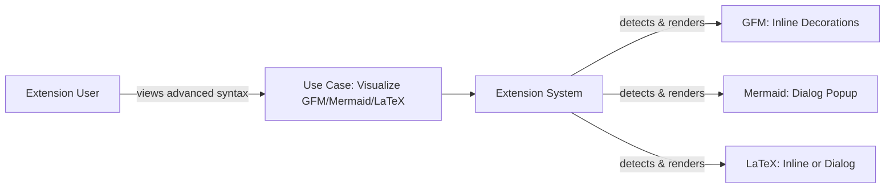

### Use Case 7: `BH1-UC-007`

- **Name:** Auto-Number Ordered Lists
- **Actor:** Extension User (`ST1-RBAC-001`)
- **Description:** User views ordered lists with automatic numbering displayed instead of raw Markdown syntax (`1.`, `2.`, etc.), making lists easier to read and scan
- **Main Flow:**
  1. User opens Markdown file containing ordered lists (`1.`, `2.`, `3.`, etc.)
  2. Extension detects ordered list syntax during parsing
  3. Extension calculates correct numbering sequence (handles nested lists, gaps in numbering)
  4. Extension applies decorations to hide raw numbering syntax (`1.`, `2.`, etc.)
  5. Extension displays auto-generated numbers in correct sequence
  6. User sees properly numbered list items without syntax markers
  7. Raw syntax remains editable when selected
- **Alternative Flows:**
  - **Alt 1:** If list numbering is non-sequential (e.g., `1.`, `5.`, `10.`), extension preserves original numbering or normalizes to sequential
  - **Alt 2:** If nested ordered lists exist, extension maintains proper indentation and numbering hierarchy
   - **Alt 3:** If list items are malformed, extension shows raw syntax for problematic items

**Use Case Diagram:**

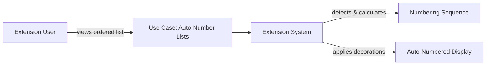

### Use Case 8: `BH1-UC-008`

- **Name:** Handle YAML Frontmatter
- **Actor:** Extension User (`ST1-RBAC-001`)
- **Description:** User views Markdown files with YAML frontmatter (metadata block at the top) with proper formatting and syntax handling
- **Main Flow:**
  1. User opens Markdown file containing YAML frontmatter (delimited by `---` at start and end)
  2. Extension detects YAML frontmatter block during parsing
  3. Extension parses YAML frontmatter separately from Markdown content
  4. Extension applies appropriate formatting/styling to frontmatter (distinct from Markdown)
  5. Extension hides or formats YAML syntax markers appropriately
  6. User sees formatted frontmatter metadata clearly separated from Markdown content
  7. Raw YAML syntax remains editable when selected
- **Alternative Flows:**
  - **Alt 1:** If YAML frontmatter is malformed, extension shows raw syntax and continues with Markdown parsing
  - **Alt 2:** If file has no frontmatter, extension processes normally as standard Markdown
  - **Alt 3:** If frontmatter delimiters are incomplete, extension treats content as standard Markdown

**Use Case Diagram:**

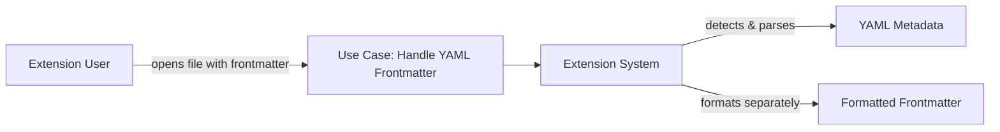

### Use Case 9: `BH1-UC-009`

- **Name:** Hide Table Syntax Markers
- **Actor:** Extension User (`ST1-RBAC-001`)
- **Description:** User views Markdown tables with syntax markers (pipes `|`, dashes `---`, alignment colons `:`) hidden, showing only formatted table structure
- **Main Flow:**
  1. User opens Markdown file containing table syntax (GFM tables with `|` separators)
  2. Extension detects table syntax during parsing
  3. Extension identifies table structure (headers, separators, rows, columns)
  4. Extension applies decorations to hide table syntax markers (`|`, `---`, `:`)
  5. Extension formats table cells with proper alignment and spacing
  6. User sees formatted table structure without syntax clutter
  7. Raw table syntax remains editable when selected
- **Alternative Flows:**
  - **Alt 1:** If table syntax is malformed (uneven columns, missing separators), extension shows raw syntax for problematic table
  - **Alt 2:** If table is very wide, extension may show partial formatting or preserve raw syntax to maintain readability
  - **Alt 3:** If table contains nested formatting (bold, italic in cells), extension applies both table and text formatting decorations

**Use Case Diagram:**

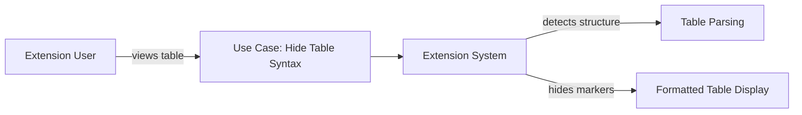

---

## Process Flow Diagrams (BPMN)

### Process Flow 1: `BH1-PF-001`

- **Name:** Markdown File Opening and Decoration Process
- **Description:** Complete process flow from file open to decoration display, including caching, parsing, and error handling

**BPMN Flowchart:**

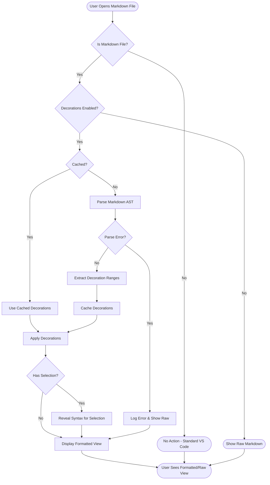

### Process Flow 2: `BH1-PF-002`

- **Name:** Text Selection and Syntax Reveal Process
- **Description:** Process for handling text selection events and revealing raw Markdown syntax for editing

**BPMN Flowchart:**

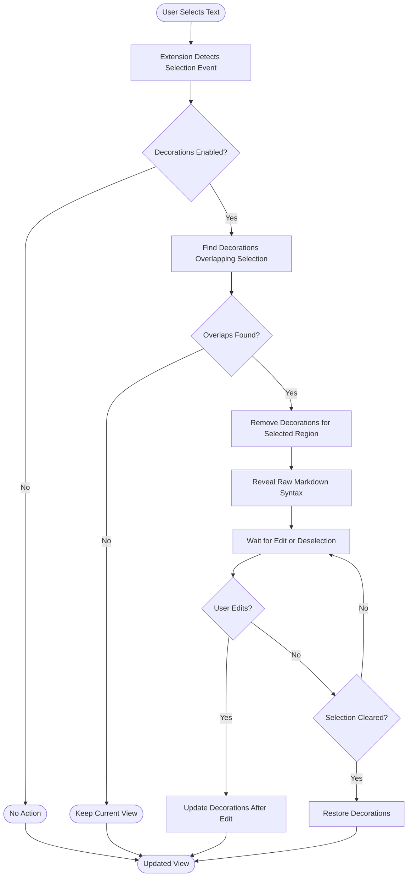

### Process Flow 3: `BH1-PF-003`

- **Name:** Performance Optimization and Caching Process
- **Description:** Process for managing cache, handling large files, and optimizing performance

**BPMN Flowchart:**

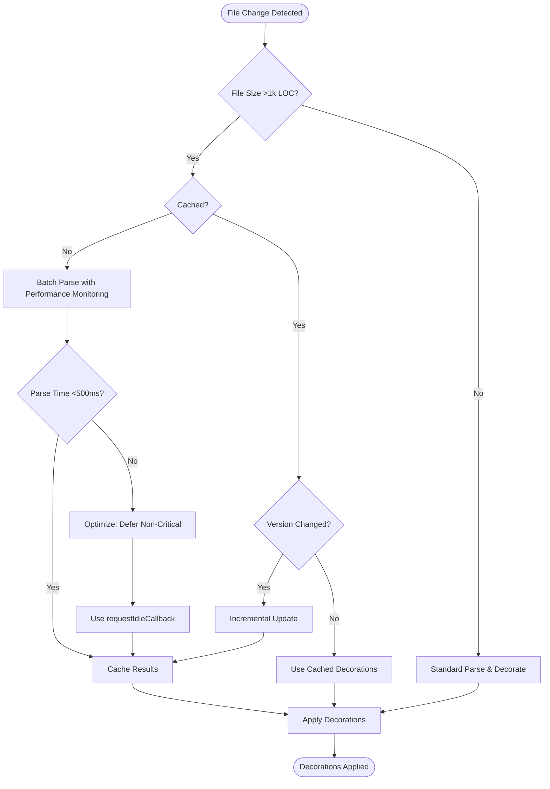

### Process Flow 4: `BH1-PF-004`

- **Name:** Advanced Syntax Visualization Process (GFM, Mermaid, LaTeX)
- **Description:** Process for detecting, parsing, and visualizing GitHub Flavored Markdown, Mermaid diagrams, and LaTeX math expressions

**BPMN Flowchart:**

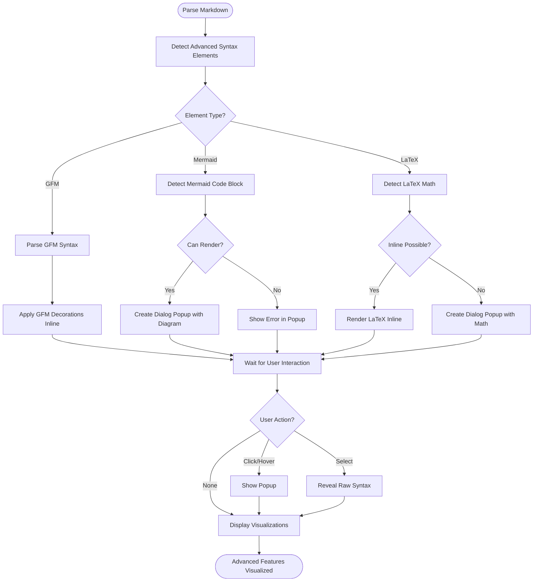

---

## Decision Tables

### Decision Table 1: `BH1-DT-001`

- **Name:** Decoration Application Decision
- **Description:** Determines when and how decorations should be applied based on file state, user actions, and system conditions

**Conditions:**
- File is Markdown type
- Decorations are enabled
- File size is acceptable
- No parse errors

**Actions:**
- Apply decorations
- Show raw Markdown
- Apply partial decorations
- Disable decorations automatically

| File is Markdown | Decorations Enabled | File Size Acceptable | No Parse Errors | Apply Decorations | Show Raw Markdown | Apply Partial Decorations | Disable Automatically |
| ---------------- | ------------------- | -------------------- | --------------- | ----------------- | ----------------- | ------------------------- | --------------------- |
| Y                | Y                   | Y                    | Y               | X                 | -                 | -                         | -                     |
| Y                | Y                   | Y                    | N               | -                 | -                 | X                         | -                     |
| Y                | Y                   | N                    | Y               | -                 | -                 | -                         | X                     |
| Y                | N                   | -                    | -               | -                 | X                 | -                         | -                     |
| N                | -                   | -                    | -               | -                 | X                 | -                         | -                     |

**Legend:** Y = Yes, N = No, - = Not applicable, X = Action executed

### Decision Table 2: `BH1-DT-002`

- **Name:** Syntax Reveal on Selection Decision
- **Description:** Determines when to reveal raw Markdown syntax based on selection state and decoration overlap

**Conditions:**
- Text is selected
- Selection overlaps with decorations
- Decorations are enabled

**Actions:**
- Reveal syntax for selection
- Keep decorations visible
- Reveal syntax for all overlapping regions

| Text Selected | Overlaps Decorations | Decorations Enabled | Reveal Syntax for Selection | Keep Decorations Visible | Reveal All Overlapping |
| ------------- | -------------------- | ------------------- | --------------------------- | ------------------------ | ---------------------- |
| Y             | Y                    | Y                   | X                           | -                        | -                      |
| Y             | N                    | Y                   | -                           | X                        | -                      |
| Y             | Y                    | N                   | -                           | X                        | -                      |
| N             | -                    | -                   | -                           | X                        | -                      |

**Legend:** Y = Yes, N = No, - = Not applicable, X = Action executed

### Decision Table 3: `BH1-DT-003`

- **Name:** Performance Optimization Decision
- **Description:** Determines performance optimization strategy based on file size and parsing time

**Conditions:**
- File size >1,000 LOC
- Parse time >500ms
- Cache available

**Actions:**
- Use standard parsing
- Use incremental updates
- Use requestIdleCallback
- Disable decorations

| File >1k LOC | Parse Time >500ms | Cache Available | Use Standard Parsing | Use Incremental Updates | Use requestIdleCallback | Disable Decorations |
| ------------ | ----------------- | --------------- | -------------------- | ----------------------- | ----------------------- | ------------------- |
| N            | -                 | -               | X                    | -                       | -                       | -                   |
| Y            | N                 | Y               | -                    | X                       | -                       | -                   |
| Y            | Y                 | Y               | -                    | X                       | -                       | -                   |
| Y            | Y                 | N               | -                    | -                       | X                       | -                   |
| Y            | Y                 | N               | -                    | -                       | -                       | X                   |

**Legend:** Y = Yes, N = No, - = Not applicable, X = Action executed

### Decision Table 4: `BH1-DT-004`

- **Name:** Advanced Syntax Visualization Decision
- **Description:** Determines how to visualize GFM syntax, Mermaid diagrams, and LaTeX math based on element type and rendering capabilities

**Conditions:**
- Element is GFM syntax
- Element is Mermaid code block
- Element is LaTeX math
- Inline rendering supported
- Dialog popup available

**Actions:**
- Apply GFM inline decorations
- Show Mermaid in dialog popup
- Render LaTeX inline
- Show LaTeX in dialog popup
- Show raw syntax

| Element is GFM | Element is Mermaid | Element is LaTeX | Inline Rendering Supported | Dialog Popup Available | Apply GFM Inline | Show Mermaid Popup | Render LaTeX Inline | Show LaTeX Popup | Show Raw Syntax |
| -------------- | ------------------ | ---------------- | -------------------------- | ---------------------- | ---------------- | ------------------ | ------------------- | ---------------- | --------------- |
| Y              | N                  | N                | -                          | -                      | X                | -                  | -                   | -                | -               |
| N              | Y                  | N                | -                          | Y                      | -                | X                  | -                   | -                | -               |
| N              | Y                  | N                | -                          | N                      | -                | -                  | -                   | -                | X               |
| N              | N                  | Y                | Y                          | -                      | -                | -                  | X                   | -                | -               |
| N              | N                  | Y                | N                          | Y                      | -                | -                  | -                   | X                | -               |
| N              | N                  | Y                | N                          | N                      | -                | -                  | -                   | -                | X               |

**Legend:** Y = Yes, N = No, - = Not applicable, X = Action executed

---

## Business Rules

| UUID         | Business Rule                  | Description                                                                                                                                                                                                    | Applies To                    |
| ------------ | ------------------------------ | -------------------------------------------------------------------------------------------------------------------------------------------------------------------------------------------------------------- | ----------------------------- |
| `BH1-BR-001` | File Compatibility Rule        | Extension must never modify file content - all decorations are read-only visual overlays. Files must remain 100% compatible with standard Markdown tooling.                                                    | All file operations           |
| `BH1-BR-002` | Zero Configuration Rule        | Extension must work immediately upon installation with no user configuration required. Auto-detection of Markdown files and theme-aware styling are mandatory.                                                 | Extension activation          |
| `BH1-BR-003` | Performance Threshold Rule     | Extension must maintain <500ms parsing time for files with 1,000 lines of code. If threshold is exceeded, extension must optimize or disable decorations automatically.                                        | File parsing                  |
| `BH1-BR-004` | Syntax Reveal Rule             | Raw Markdown syntax must be revealed immediately when user selects text, and restored when selection is cleared. Reveal applies only to selected regions, not entire document.                                 | Text selection                |
| `BH1-BR-005` | Cache Management Rule          | Extension must cache parsed decorations with LRU eviction (max 10 documents). Cache must be invalidated when document version changes.                                                                         | Decoration caching            |
| `BH1-BR-006` | Error Handling Rule            | Extension must gracefully handle parse errors without crashing. On error, extension should log error, show raw Markdown, and allow normal editing to continue.                                                 | Error scenarios               |
| `BH1-BR-007` | Decoration Toggle Rule         | Toggle state is global (applies to all Markdown files). Toggle must be accessible via toolbar button and command palette. State change must be immediate and persistent.                                       | Decoration toggle             |
| `BH1-BR-008` | Theme Adaptation Rule          | Decorations must automatically adapt to VS Code color theme. Extension must use theme colors for all decoration styling (no hardcoded colors).                                                                 | Decoration styling            |
| `BH1-BR-009` | Line Ending Compatibility Rule | Extension must support both CRLF and LF line endings. Position calculations must account for line ending differences.                                                                                          | File parsing                  |
| `BH1-BR-010` | Incremental Update Rule        | Extension must use incremental updates for document changes. Full re-parsing should only occur when necessary (cache miss, major changes).                                                                     | Decoration updates            |
| `BH1-BR-011` | GFM Syntax Support Rule        | Extension must support GitHub Flavored Markdown syntax (tables, task lists, strikethrough) with inline decorations. GFM elements must be visually distinct from standard Markdown.                             | GFM syntax visualization      |
| `BH1-BR-012` | Mermaid Visualization Rule     | Extension must detect Mermaid code blocks (```mermaid) and render diagrams in dialog popups. Popups must be triggered on user interaction (click/hover). Raw Mermaid syntax must remain editable.              | Mermaid diagram visualization |
| `BH1-BR-013` | LaTeX Math Visualization Rule  | Extension must attempt inline LaTeX math rendering when supported by VS Code theme. If inline rendering is not possible, extension must show rendered math in dialog popup. LaTeX syntax must remain editable. | LaTeX math visualization      |

---

## Exception Logic & Error Handling

### Exception Scenario 1: `BH1-EX-001`

- **Name:** Markdown Parse Error
- **Description:** Extension encounters an error while parsing Markdown content (malformed syntax, unsupported features, parser crash)
- **Trigger:** remark parser throws exception or returns invalid AST during `extractDecorations()` call
- **Handling:** Extension catches error, logs to console, returns empty decorations array, and continues normal operation. User sees raw Markdown without decorations. File remains editable.

**Exception Flow Diagram:**

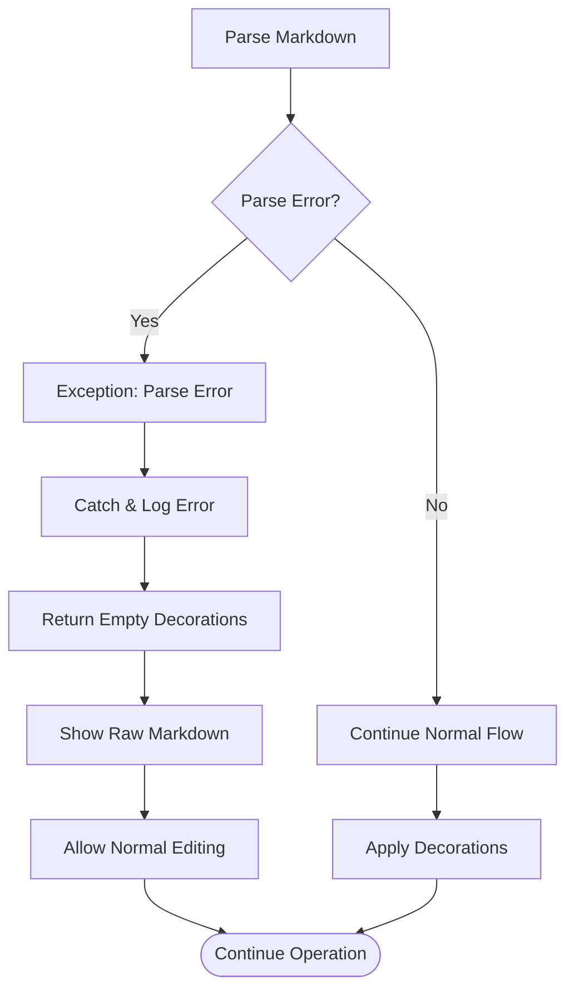

### Exception Scenario 2: `BH1-EX-002`

- **Name:** Performance Degradation
- **Description:** Extension detects performance degradation (parsing time exceeds 500ms threshold) for large files
- **Trigger:** File parsing takes >500ms or file size >1MB detected during performance monitoring
- **Handling:** Extension switches to optimized mode: uses requestIdleCallback for non-critical updates, defers some decorations, or automatically disables decorations for that file with user notification. User can manually re-enable if desired.

**Exception Flow Diagram:**

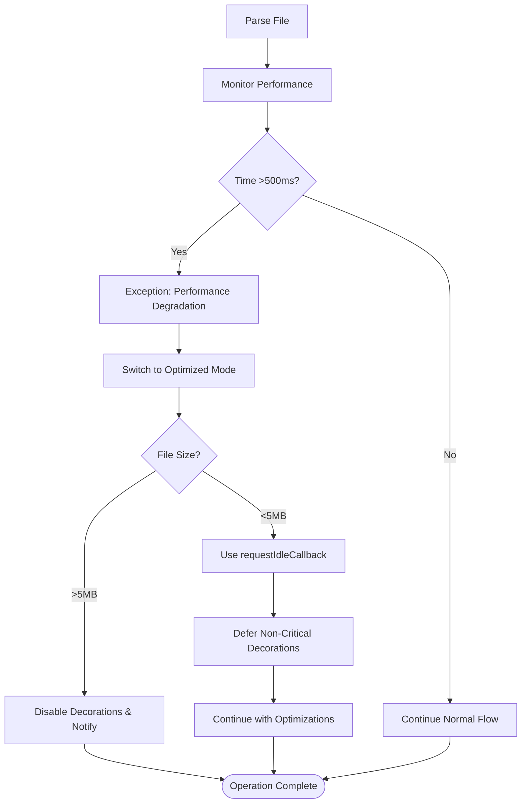

### Exception Scenario 3: `BH1-EX-003`

- **Name:** Document Stale During Update
- **Description:** Document version changes while extension is parsing or applying decorations (race condition)
- **Trigger:** Document version number changes between parse start and decoration application
- **Handling:** Extension detects stale document version, cancels current update, and triggers new update with latest document version. Prevents applying outdated decorations.

**Exception Flow Diagram:**

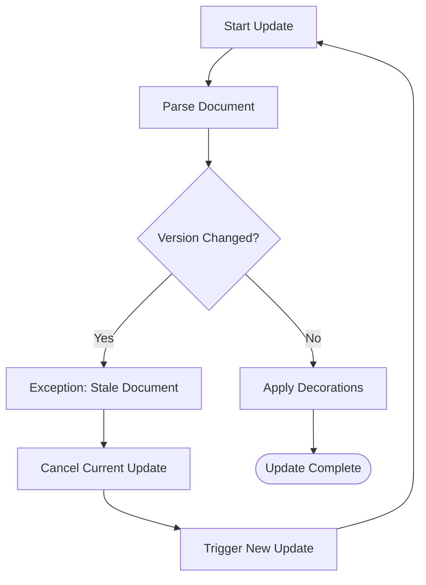

### Exception Scenario 4: `BH1-EX-004`

- **Name:** Cache Eviction Failure
- **Description:** Extension cache reaches maximum size and LRU eviction fails or causes issues
- **Trigger:** Cache size exceeds maxCacheSize (10 documents) and eviction process encounters error
- **Handling:** Extension clears entire cache, logs warning, and continues with fresh parsing. Performance may temporarily degrade but operation continues normally.

**Exception Flow Diagram:**

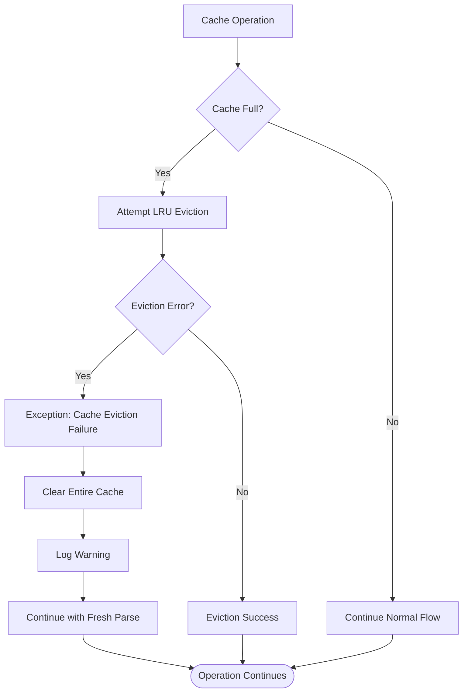

---

## Validation Checklist

- [x] All use cases documented with actors, main flows, and alternative flows
- [x] Use case diagrams created in Mermaid format
- [x] BPMN process flowcharts complete with decision points
- [x] Decision tables defined with conditions and actions
- [x] Business rules documented
- [x] Exception logic mapped with error handling flows
- [x] All UUIDs generated and unique
- [x] Dependencies on BN1 are satisfied
- [x] Status updated to "complete"

---

**Next Steps:** [PM1] Resource Planning, [PM2] Risk Assessment, [DM1] Data Model, [DE1] Design Model, [AR1] Architecture Model
