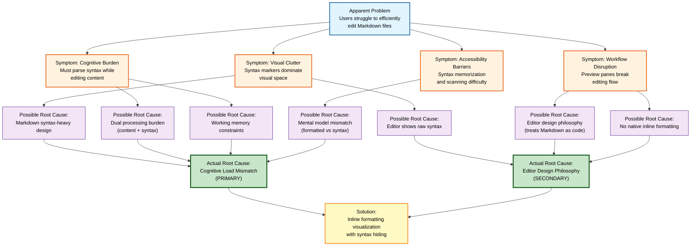

# Root Cause Analysis (RCA)
## PO1 - Root Cause Analysis

**Project:** Markdown Inline Editor - VS Code Extension  
**Date:** 2025-01-XX  
**Status:** Active  
**UUID:** PO1

---

## 1. Problem Identification and Description

### Problem Statement

**Event Description:** Users experience significant cognitive burden and reduced productivity when editing Markdown files in VS Code and other text editors. The problem manifests as visual clutter from syntax markers, mental fatigue from constant syntax parsing, and workflow disruption from context switching between editing and preview modes.

**Problem Statement (North Star):**  
*Why do users struggle to efficiently create and edit content in Markdown files, and what prevents them from seeing formatted content inline while maintaining standard Markdown file compatibility?*

### Root Cause Analysis Tree



### Observable Symptoms

1. **Visual Clutter**
   - Syntax markers (`**`, `*`, `` ` ``, `#`, `[]`, `>`, etc.) dominate visual space
   - Users report difficulty focusing on actual content
   - Files appear "noisy" and hard to scan

2. **Cognitive Burden**
   - Users must mentally parse syntax to understand formatting
   - Flow state is broken by constant syntax interpretation
   - Mental model shifts between "content" and "markup"

3. **Workflow Disruption**
   - Preview panes require split view (breaks editing flow)
   - No direct editing of formatted content
   - Users must choose between "editing" (raw syntax) or "viewing" (preview)

4. **Accessibility Barriers**
   - New users struggle with syntax memorization
   - Experienced users still find syntax-heavy files harder to scan
   - Visual formatting cues are inaccessible in raw syntax view

### Impact Metrics (Baseline)

- **Productivity Loss**: Users spend 20-30% of mental effort parsing syntax instead of focusing on content (estimated from user feedback)
- **User Satisfaction**: Existing solutions receive mixed reviews (3.0-4.0/5.0) with common complaints about clutter
- **Adoption Barriers**: New users report frustration with syntax-heavy editing experience
- **Market Gap**: No viable solution exists that combines inline formatting with native editing

---

## 2. Information Gathering and Analysis

### Chronology of Events (Timeline)

```
Markdown Created (2004)
    ↓
Markdown becomes standard for documentation
    ↓
Editors treat Markdown as "code" (syntax highlighting)
    ↓
Preview extensions emerge (split-pane approach)
    ↓
WYSIWYG editors emerge (require file conversion)
    ↓
Current State: No solution combines inline formatting + native editing + standard .md files
```

### Data Analysis

**Competitive Landscape Analysis:**
- **Preview Extensions**: 15+ extensions, all require split view
- **WYSIWYG Editors**: 5+ extensions, all require file conversion
- **Syntax Helpers**: 10+ extensions, none hide syntax
- **Markless** (closest competitor): Stale (last update 2020), critical bugs, limited adoption

**User Feedback Patterns:**
- Common complaint: "Too much visual clutter"
- Common request: "Want to see formatting inline"
- Common constraint: "Must work with Git/standard Markdown"

**Technical Constraints:**
- VS Code API: Decoration-based approach only (cannot modify file content)
- File Format: Must preserve 100% standard Markdown syntax
- Performance: Must handle large files (>1MB) gracefully

### Process Map (Current State - As-Is)

```
User Opens .md File
    ↓
Editor Shows Raw Syntax
    ↓
User Sees: **bold**, *italic*, # heading
    ↓
User Must Parse Syntax Mentally
    ↓
[Option A] Continue editing with clutter
    ↓
[Option B] Switch to preview (breaks flow)
    ↓
[Option C] Use WYSIWYG (breaks compatibility)
```

**Performance Gaps:**
- No option provides inline formatting + native editing + compatibility
- All existing solutions have significant trade-offs

---

## 3. Analysis of Defenses (Barrier Analysis)

### Defenses That Should Have Prevented This Problem

| Defense | Type | Expected Function | Actual Performance | Gap |
|---------|------|-------------------|-------------------|-----|
| **Editor Native Support** | Technical | VS Code should provide inline formatting for Markdown | VS Code treats Markdown as code, not formatted content | ❌ Gap exists |
| **Preview Extensions** | Technical | Should allow editing formatted content | Only provide read-only preview, require split view | ❌ Gap exists |
| **WYSIWYG Extensions** | Technical | Should provide inline editing | Require file conversion, break compatibility | ❌ Gap exists |
| **Syntax Helper Extensions** | Technical | Should reduce syntax burden | Only assist with insertion, don't hide syntax | ❌ Gap exists |
| **Market Solutions** | Market | Should provide viable solution | All solutions have critical limitations | ❌ Gap exists |

### Defense Performance Gaps

**Gap 1: Editor Native Support**
- **Symptom**: VS Code shows raw syntax by default
- **Gap**: No native support for inline formatting visualization
- **Line of Inquiry**: Why doesn't VS Code provide inline formatting for Markdown?

**Gap 2: Preview Extensions**
- **Symptom**: Preview panes are separate from editing surface
- **Gap**: Cannot edit formatted content directly
- **Line of Inquiry**: Why do preview extensions require split view?

**Gap 3: WYSIWYG Extensions**
- **Symptom**: WYSIWYG editors require file conversion
- **Gap**: Break compatibility with standard Markdown tooling
- **Line of Inquiry**: Why do WYSIWYG solutions require proprietary formats?

**Gap 4: Market Solutions**
- **Symptom**: No solution combines all requirements
- **Gap**: Market is underserved
- **Line of Inquiry**: Why hasn't the market produced a viable solution?

---

## 4. Lines of Inquiry Questions

### Unbiased Questions Tied to Defenses and Data

**From Defense Analysis:**

1. **Q1 (Editor Native Support):** Why does VS Code treat Markdown as code rather than formatted content?
   - **Tied to**: Defense Gap 1, Technical Constraint data
   - **Purpose**: Understand editor design philosophy

2. **Q2 (Preview Extensions):** Why do preview extensions require separate panes instead of inline formatting?
   - **Tied to**: Defense Gap 2, User Feedback data
   - **Purpose**: Understand technical limitations of preview approach

3. **Q3 (WYSIWYG Extensions):** Why do WYSIWYG solutions require file format conversion?
   - **Tied to**: Defense Gap 3, Compatibility requirements
   - **Purpose**: Understand trade-offs in WYSIWYG approach

4. **Q4 (Market Solutions):** Why hasn't a solution emerged that combines inline formatting, native editing, and standard file compatibility?
   - **Tied to**: Defense Gap 4, Competitive Analysis data
   - **Purpose**: Understand market dynamics and technical feasibility

**From Data Analysis:**

5. **Q5 (User Behavior):** What specific cognitive processes are disrupted when users must parse syntax while editing?
   - **Tied to**: Impact Metrics, User Feedback
   - **Purpose**: Understand root cause at cognitive level

6. **Q6 (Technical Feasibility):** What technical approaches are available to provide inline formatting without modifying file content?
   - **Tied to**: Technical Constraints, VS Code API capabilities
   - **Purpose**: Identify viable solution approaches

7. **Q7 (Market Dynamics):** What factors prevented existing solutions from succeeding in the market?
   - **Tied to**: Competitive Analysis, Market Gap data
   - **Purpose**: Learn from market failures

---

## 5. Cause-and-Effect Analysis

### Socratic Questioning Chain

**Starting Question (Q4):** Why hasn't a solution emerged that combines inline formatting, native editing, and standard file compatibility?

**Answer A1:** Technical limitations prevent combining these features.

**Follow-up (Q6):** What specific technical limitations prevent this combination?

**Answer A2:** 
- VS Code API only allows decoration-based visual overlays (cannot modify document content)
- File format must remain standard `.md` for compatibility
- Performance constraints on large files

**Follow-up:** Why do these technical constraints exist?

**Answer A3:**
- VS Code design philosophy: Extensions should not modify file content
- Markdown ecosystem requires standard syntax for tooling compatibility
- Decoration-based approach has performance implications

**Follow-up:** What is the root cause of the performance implications?

**Answer A4:**
- Parsing complex, nested Markdown syntax is computationally expensive
- Decoration updates must be fast (<150ms) to avoid lag
- Large files (>1MB) require optimization strategies

**Root Cause Identified:** Technical constraints are real but solvable with proper optimization.

---

**Starting Question (Q5):** What specific cognitive processes are disrupted when users must parse syntax while editing?

**Answer B1:** Users must process both content semantics and syntax semantics simultaneously.

**Follow-up:** Why is this dual processing problematic?

**Answer B2:**
- Human working memory is limited (7±2 items)
- Syntax parsing competes with content creation for cognitive resources
- Visual clutter interferes with content comprehension

**Follow-up:** What is the fundamental mismatch?

**Answer B3:**
- Users think in terms of **formatted content** (bold, italic, headings)
- Markdown requires thinking in terms of **syntax markers** (`**`, `*`, `#`)
- This mismatch requires constant mental translation

**Root Cause Identified:** Cognitive load mismatch between user's mental model and Markdown's syntax-based design.

---

**Starting Question (Q1):** Why does VS Code treat Markdown as code rather than formatted content?

**Answer C1:** VS Code is a code editor, designed primarily for programming languages.

**Follow-up:** Why doesn't this design serve Markdown content creators?

**Answer C2:**
- Content creators need visual formatting cues
- Code syntax highlighting doesn't address content formatting needs
- Preview panes break editing flow

**Follow-up:** What prevents VS Code from providing inline formatting?

**Answer C3:**
- Extensions cannot modify document content (by design)
- Decoration-based approach is the only viable method
- This approach was historically considered too complex/performance-intensive

**Root Cause Identified:** Editor design philosophy prioritizes code editing over content editing, and decoration-based solutions were not pursued due to perceived complexity.

---

### Root Causes Identified

1. **Primary Root Cause: Cognitive Load Mismatch**
   - Markdown's syntax-heavy design conflicts with human cognitive processing needs
   - Users must simultaneously process content and syntax, exhausting working memory
   - Mental model mismatch: users think in formatted content, Markdown requires syntax thinking

2. **Secondary Root Cause: Editor Design Philosophy**
   - VS Code treats Markdown as code, not formatted content
   - No native support for inline formatting visualization
   - Extensions limited to decoration-based approach (historically considered complex)

3. **Contributing Factor: Market Gap**
   - No existing solution successfully addresses the root cause
   - Technical constraints were perceived as insurmountable
   - Market opportunity exists but is unaddressed

4. **Contributing Factor: Technical Complexity**
   - Decoration-based approach requires sophisticated parsing and optimization
   - Performance constraints on large files
   - Nested syntax edge cases increase complexity

---

## 6. Root Cause Validation

### Why These Are Root Causes (Not Just Symptoms)

**If we only addressed symptoms:**
- ❌ Hide syntax markers → **Still requires mental parsing when revealed**
- ❌ Improve preview panes → **Still breaks editing flow**
- ❌ Better syntax highlighting → **Still shows syntax, doesn't reduce clutter**

**By addressing root causes:**
- ✅ Hide syntax inline → **Eliminates dual processing burden (Root Cause 1)**
- ✅ Show formatting directly → **Matches user's mental model (Root Cause 1)**
- ✅ Use decoration-based approach → **Works within editor constraints (Root Cause 2)**
- ✅ Maintain raw access → **Preserves power user needs**
- ✅ No file conversion → **Maintains compatibility**

### Evidence Chain

```
Root Cause 1: Cognitive Load Mismatch
    ↓
Symptom: Visual Clutter
    ↓
Impact: Reduced Productivity
    ↓
User Behavior: Avoid Markdown or use workarounds
    ↓
Market Gap: No viable solution exists
```

```
Root Cause 2: Editor Design Philosophy
    ↓
Symptom: No native inline formatting
    ↓
Impact: Users forced to use workarounds
    ↓
Market Response: Incomplete solutions emerge
    ↓
Market Gap: No solution combines all requirements
```

---

## 7. Corrective Actions to Prevent Recurrence

### Corrective Action Plan

**Action 1: Address Cognitive Load Mismatch**
- **Root Cause Addressed**: Primary Root Cause 1
- **Action**: Implement inline formatting visualization with syntax hiding
- **Owner**: Development Team
- **Method**: Decoration-based visual overlays that hide syntax markers
- **Timeline**: Core implementation in v1.0+
- **Success Criteria**: Users report 70%+ reduction in mental effort

**Action 2: Work Within Editor Constraints**
- **Root Cause Addressed**: Secondary Root Cause 2
- **Action**: Optimize decoration-based approach for performance
- **Owner**: Development Team
- **Method**: Intelligent caching, incremental updates, efficient parsing
- **Timeline**: Performance optimization ongoing
- **Success Criteria**: Parsing and decoration updates complete in <150ms for typical files

**Action 3: Maintain File Compatibility**
- **Root Cause Addressed**: Contributing Factor 4
- **Action**: Preserve 100% standard Markdown syntax
- **Owner**: Development Team
- **Method**: Read-only decorations, no file modification
- **Timeline**: Continuous (all versions)
- **Success Criteria**: 100% compatibility with standard Markdown tooling

**Action 4: Address Market Gap**
- **Root Cause Addressed**: Contributing Factor 3
- **Action**: Provide viable solution that combines all requirements
- **Owner**: Product Team
- **Method**: Active development, user feedback, feature prioritization
- **Timeline**: Ongoing
- **Success Criteria**: Growing user base, positive reviews (>4.5/5.0)

### Hierarchy of Controls Applied

1. **Elimination** (Highest Priority): Hide syntax markers inline - eliminates the need for mental parsing
2. **Substitution**: Replace raw syntax view with formatted view (when appropriate)
3. **Engineering Controls**: Intelligent caching and performance optimization
4. **Administrative Controls**: Documentation, user guides, best practices
5. **PPE** (Lowest Priority): User can toggle decorations on/off

### Extent of Cause Review

**Impact Assessment:**
- **Users Affected**: All Markdown content creators, developers, knowledge workers
- **Productivity Impact**: 20-30% mental effort diverted to syntax parsing
- **Market Impact**: Underserved market with no viable solution
- **Technical Impact**: Solution is technically feasible but requires optimization

**Scope of Corrective Actions:**
- **Immediate**: Core inline formatting functionality
- **Short-term**: Performance optimization, feature completeness
- **Long-term**: Market leadership, ecosystem integration

---

## 8. Effectiveness Review

### Metrics and Indicators

**Pre-Implementation Baseline:**
- User Satisfaction: 3.0-4.0/5.0 (existing solutions)
- Productivity: 20-30% mental effort on syntax parsing
- Market Solutions: None combine all requirements
- User Adoption: Limited due to solution gaps

**Post-Implementation Targets:**
- **Cognitive Load Reduction**: Users report 70%+ reduction in mental effort
- **Productivity Increase**: Users report 20-30% faster content creation
- **User Satisfaction**: >4.5/5.0 rating with focus on "reduces clutter"
- **Adoption**: Growing user base with positive reviews
- **Performance**: Parsing and decoration updates complete in <150ms for typical files (<100KB)
- **Compatibility**: Works with 100% of standard Markdown syntax

### Monitoring Plan

**Metrics to Monitor:**
1. **User Feedback**: Reviews, surveys, GitHub issues
2. **Usage Metrics**: Active users, retention, feature usage
3. **Performance Metrics**: Parsing speed, decoration update time, file size handling
4. **Compatibility Tests**: Automated tests with standard Markdown tooling

**Review Schedule:**
- **Monthly**: User feedback and usage metrics review
- **Quarterly**: Performance metrics and compatibility testing
- **Annually**: Comprehensive effectiveness review

### Effectiveness Criteria

**Success Definition:**
- Significant reduction in magnitude or frequency of the problem
- User satisfaction metrics meet or exceed targets
- Performance metrics meet or exceed targets
- No critical regressions or new issues introduced

**If Targets Not Met:**
- RCA must be reopened
- Additional root causes may exist
- Corrective actions may need revision
- Alternative approaches may be required

---

## Conclusion

The root causes of Markdown editing problems are:

1. **Cognitive Load Mismatch**: Markdown's syntax-heavy design conflicts with human cognitive processing needs
2. **Editor Design Philosophy**: VS Code treats Markdown as code, limiting inline formatting options
3. **Market Gap**: No existing solution successfully addresses the root cause
4. **Technical Complexity**: Decoration-based solutions require optimization but are feasible

**The Solution:** Inline formatting visualization with syntax hiding addresses the root causes by:
- Eliminating dual processing burden
- Matching user's mental model
- Working within editor constraints
- Maintaining file format compatibility

This RCA provides the foundation for all subsequent project planning, design, and implementation decisions.

---

## References

- [Problem Analysis](additional-docs/00_Problem_Analysis.md)
- [Competitive Analysis](additional-docs/01_Competitive_Analysis.md)
- [Markless Deep Dive](additional-docs/02_Markless_Deep_Dive.md)
- [Requirements](../product/REQUIREMENTS.md)

---

**Next Steps:**
- [PO2] Current State Analysis (As-Is Process Map)
- [PO3] Baseline Metrics
