# Current State Analysis (As-Is Process Map)
## PO2 - Current State Analysis

**Project:** Markdown Inline Editor - VS Code Extension  
**Date:** 2025-01-XX  
**Status:** Active  
**UUID:** PO2  
**Dependent On:** PO1

---

## 1. Executive Summary

This document maps the **current broken workflow** (As-Is state) for editing Markdown files in VS Code and other text editors. The analysis identifies pain points, decision branches, and workflow disruptions that prevent users from efficiently creating and editing Markdown content.

**Key Findings:**
- Users face **three primary workflow paths**, all with significant trade-offs
- **No path** provides inline formatting + native editing + standard file compatibility
- **Cognitive burden** is highest in the default "raw syntax" path
- **Workflow disruption** occurs in all alternative paths (preview, WYSIWYG)

---

## 2. High-Level User Journey (As-Is)

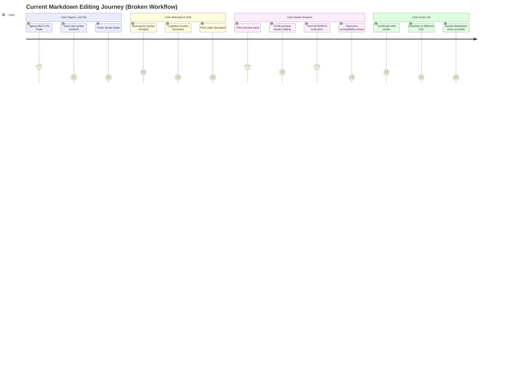

---

## 3. Detailed Process Map (As-Is Workflow)

### 3.1 Primary Workflow - Raw Syntax Editing (Default Path)

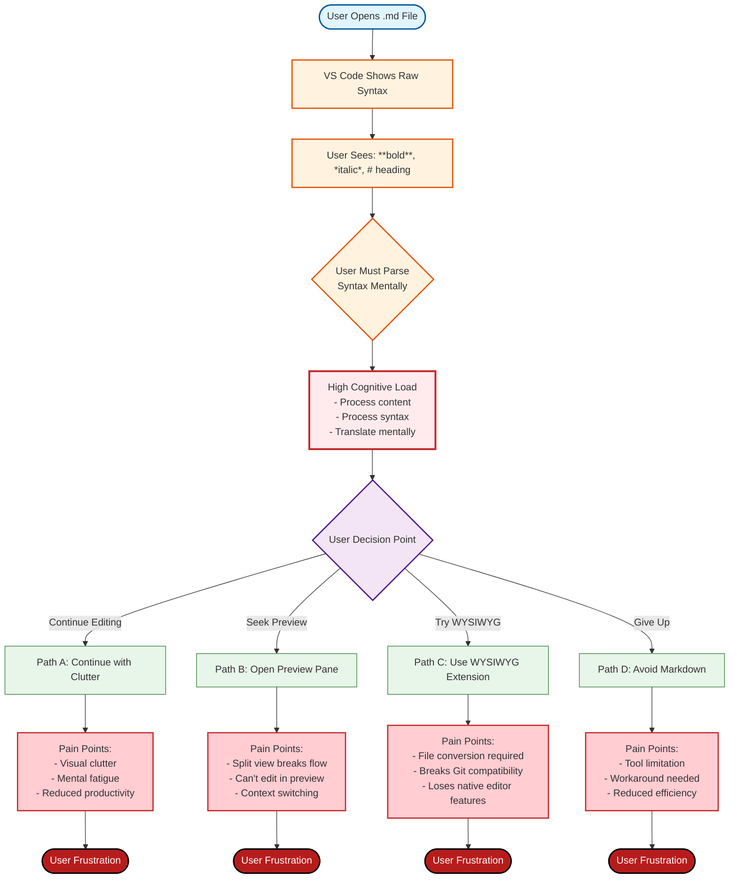

### 3.2 Path A: Continue with Clutter (Most Common)

```mermaid
flowchart LR
    Start([User Continues Editing]) --> EditContent[User Types Content]
    EditContent --> AddSyntax[User Adds Syntax Markers<br/>**bold**, *italic*, # heading]
    AddSyntax --> SeeBoth[User Sees Both:<br/>- Content text<br/>- Syntax markers]
    SeeBoth --> DualProcess{User Must Process:<br/>1. Content meaning<br/>2. Syntax meaning}
    DualProcess --> MentalTranslation[User Translates:<br/>Syntax → Formatting<br/>in their mind]
    MentalTranslation --> WorkingMemory[Working Memory Load:<br/>- Content semantics<br/>- Syntax semantics<br/>- Formatting intent]
    WorkingMemory --> Fatigue[Cognitive Fatigue<br/>20-30% mental effort<br/>on syntax parsing]
    Fatigue --> ReducedProductivity[Reduced Productivity<br/>Slower content creation]
    ReducedProductivity --> Frustration([User Frustration])
    
    style Start fill:#e1f5ff,stroke:#01579b,stroke-width:2px
    style DualProcess fill:#fff3e0,stroke:#e65100,stroke-width:2px
    style MentalTranslation fill:#ffebee,stroke:#c62828,stroke-width:2px
    style WorkingMemory fill:#ffebee,stroke:#c62828,stroke-width:2px
    style Fatigue fill:#ffcdd2,stroke:#c62828,stroke-width:3px
    style ReducedProductivity fill:#ffcdd2,stroke:#c62828,stroke-width:2px
    style Frustration fill:#b71c1c,stroke:#000,stroke-width:2px,color:#fff
```

### 3.3 Path B: Preview Pane Workflow

```mermaid
flowchart TD
    Start([User Opens Preview Pane]) --> SplitView[VS Code Opens Split View<br/>Left: Editor | Right: Preview]
    SplitView --> EditLeft[User Edits in Left Pane<br/>Raw Syntax View]
    EditLeft --> SeeRight[User Looks at Right Pane<br/>Formatted Preview]
    SeeRight --> ContextSwitch{User Must Switch<br/>Between Panes}
    ContextSwitch --> BreakFlow[Workflow Disruption:<br/>- Eye movement<br/>- Focus shift<br/>- Mental context switch]
    BreakFlow --> CannotEditPreview[User Cannot Edit<br/>in Preview Pane]
    CannotEditPreview --> MustReturn[User Must Return<br/>to Raw Syntax View]
    MustReturn --> BackToClutter[Back to Path A<br/>Visual Clutter]
    BackToClutter --> Frustration([User Frustration])
    
    style Start fill:#e1f5ff,stroke:#01579b,stroke-width:2px
    style SplitView fill:#fff3e0,stroke:#e65100,stroke-width:2px
    style ContextSwitch fill:#ffebee,stroke:#c62828,stroke-width:2px
    style BreakFlow fill:#ffcdd2,stroke:#c62828,stroke-width:3px
    style CannotEditPreview fill:#ffcdd2,stroke:#c62828,stroke-width:2px
    style MustReturn fill:#ffcdd2,stroke:#c62828,stroke-width:2px
    style BackToClutter fill:#ffcdd2,stroke:#c62828,stroke-width:2px
    style Frustration fill:#b71c1c,stroke:#000,stroke-width:2px,color:#fff
```

### 3.4 Path C: WYSIWYG Extension Workflow

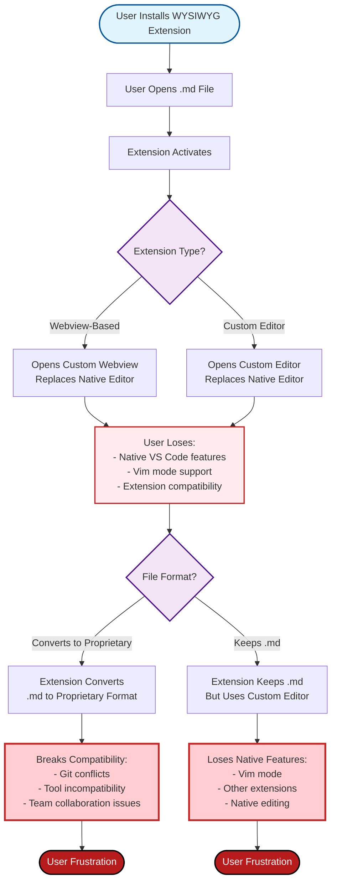

---

## 4. Cognitive Process Map (Mental Workflow)

### 4.1 Dual Processing Burden

```mermaid
flowchart TD
    UserSees[User Sees Text:<br/>**bold text**] --> VisualInput[Visual Input Processing]
    VisualInput --> SplitAttention{Attention Split}
    
    SplitAttention -->|Path 1| ProcessSyntax[Process Syntax:<br/>- Identify ** markers<br/>- Parse syntax meaning<br/>- Understand formatting intent]
    SplitAttention -->|Path 2| ProcessContent[Process Content:<br/>- Read 'bold text'<br/>- Understand semantics<br/>- Comprehend meaning]
    
    ProcessSyntax --> WorkingMemory1[Working Memory Slot 1:<br/>Syntax Processing]
    ProcessContent --> WorkingMemory2[Working Memory Slot 2:<br/>Content Processing]
    
    WorkingMemory1 --> MentalTranslation[Mental Translation:<br/>Syntax → Formatting]
    WorkingMemory2 --> MentalTranslation
    
    MentalTranslation --> Combine[Combine Understanding:<br/>'bold text' = formatted]
    Combine --> CognitiveLoad[High Cognitive Load<br/>7±2 Working Memory Limit]
    CognitiveLoad --> Fatigue[Cognitive Fatigue]
    Fatigue --> ReducedPerformance[Reduced Performance]
    
    style UserSees fill:#e1f5ff,stroke:#01579b,stroke-width:2px
    style SplitAttention fill:#fff3e0,stroke:#e65100,stroke-width:2px
    style ProcessSyntax fill:#ffebee,stroke:#c62828,stroke-width:2px
    style ProcessContent fill:#ffebee,stroke:#c62828,stroke-width:2px
    style MentalTranslation fill:#ffcdd2,stroke:#c62828,stroke-width:3px
    style CognitiveLoad fill:#ffcdd2,stroke:#c62828,stroke-width:3px
    style Fatigue fill:#b71c1c,stroke:#000,stroke-width:2px,color:#fff
    style ReducedPerformance fill:#b71c1c,stroke:#000,stroke-width:2px,color:#fff
```

### 4.2 Mental Model Mismatch

```mermaid
flowchart LR
    UserThinks[User Thinks:<br/>'I want bold text'] --> MentalModel[User's Mental Model:<br/>Formatted Content]
    MentalModel --> MarkdownRequires[Markdown Requires:<br/>Syntax Markers]
    MarkdownRequires --> TranslationNeeded[Translation Needed:<br/>Formatted → Syntax]
    TranslationNeeded --> UserTypes[User Types:<br/>**bold text**]
    UserTypes --> SeeSyntax[User Sees:<br/>**bold text**]
    SeeSyntax --> ReverseTranslation[Reverse Translation:<br/>Syntax → Formatted]
    ReverseTranslation --> MentalModel
    
    TranslationNeeded -.->|Constant Loop| SeeSyntax
    
    style UserThinks fill:#e1f5ff,stroke:#01579b,stroke-width:2px
    style MentalModel fill:#fff3e0,stroke:#e65100,stroke-width:2px
    style MarkdownRequires fill:#ffebee,stroke:#c62828,stroke-width:2px
    style TranslationNeeded fill:#ffcdd2,stroke:#c62828,stroke-width:3px
    style ReverseTranslation fill:#ffcdd2,stroke:#c62828,stroke-width:3px
```

---

## 5. Technical Workflow (Current Solutions)

### 5.1 VS Code Native Behavior

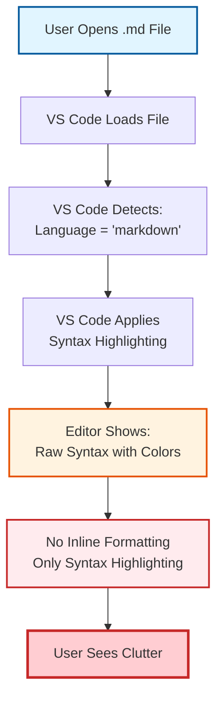

### 5.2 Preview Extension Workflow

```mermaid
flowchart TD
    UserOpens[User Opens .md File] --> ExtensionDetects[Preview Extension Detects .md]
    ExtensionDetects --> ParseMarkdown[Extension Parses Markdown<br/>to HTML]
    ParseMarkdown --> CreateWebview[Extension Creates<br/>Webview Panel]
    CreateWebview --> RenderHTML[Webview Renders<br/>Formatted HTML]
    RenderHTML --> ShowPreview[Preview Pane Shows:<br/>Formatted Content]
    ShowPreview --> SplitView[Split View Created:<br/>Editor | Preview]
    SplitView --> UserEdits[User Edits in Editor<br/>Raw Syntax]
    UserEdits --> AutoUpdate[Preview Auto-Updates<br/>on File Change]
    AutoUpdate --> ShowPreview
    
    style UserOpens fill:#e1f5ff,stroke:#01579b,stroke-width:2px
    style SplitView fill:#fff3e0,stroke:#e65100,stroke-width:2px
    style UserEdits fill:#ffebee,stroke:#c62828,stroke-width:2px
```

### 5.3 WYSIWYG Extension Workflow (Webview-Based)

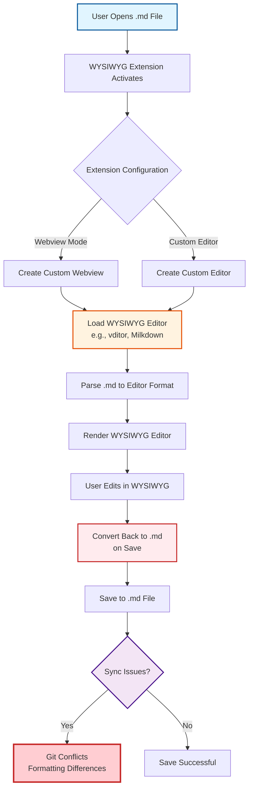

---

## 6. Pain Point Identification

### 6.1 Pain Point Map

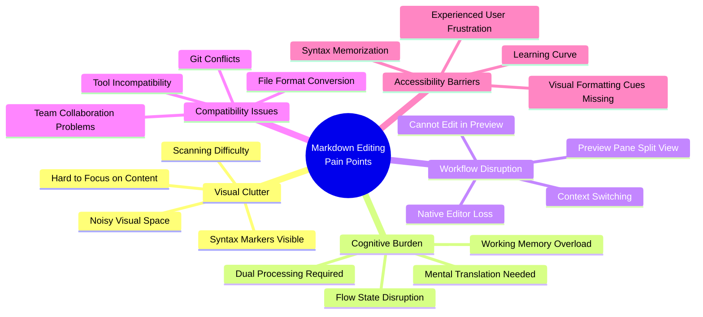

### 6.2 Pain Point Severity Matrix

| Pain Point                 | Frequency                | Impact | Severity   | Affected Path    |
| -------------------------- | ------------------------ | ------ | ---------- | ---------------- |
| **Visual Clutter**         | High (100% of users)     | High   | 🔴 Critical | Path A (Default) |
| **Cognitive Burden**       | High (100% of users)     | High   | 🔴 Critical | Path A (Default) |
| **Workflow Disruption**    | Medium (30% use preview) | High   | 🔴 Critical | Path B (Preview) |
| **Compatibility Issues**   | Low (10% use WYSIWYG)    | High   | 🟠 High     | Path C (WYSIWYG) |
| **Accessibility Barriers** | High (all new users)     | Medium | 🟠 High     | All Paths        |

---

## 7. Decision Tree Analysis

### 7.1 User Decision Tree

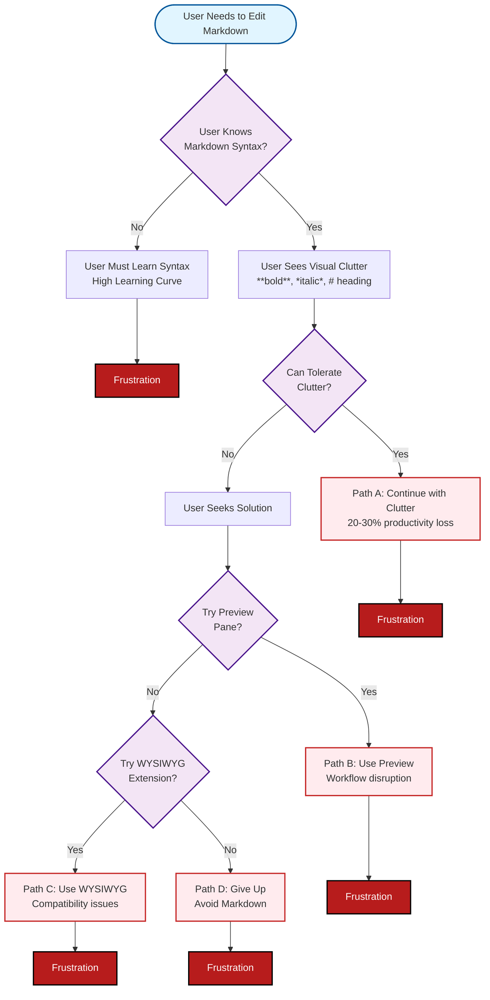

---

## 8. Workflow Metrics (As-Is Baseline)

### 8.1 Time and Effort Metrics

| Activity                     | Current Time           | Ideal Time | Waste        | % Waste |
| ---------------------------- | ---------------------- | ---------- | ------------ | ------- |
| **Parse Syntax Mentally**    | 20-30% of editing time | 0%         | 20-30%       | 20-30%  |
| **Context Switch (Preview)** | 2-3 seconds per switch | 0 seconds  | 2-3 seconds  | 100%    |
| **Mental Translation**       | Constant               | 0%         | Constant     | 100%    |
| **Visual Scanning**          | 2x slower              | 1x         | 2x slower    | 50%     |
| **Flow State Recovery**      | 5-10 seconds           | 0 seconds  | 5-10 seconds | 100%    |

### 8.2 User Satisfaction Metrics

| Metric                  | Current State       | Target State | Gap          |
| ----------------------- | ------------------- | ------------ | ------------ |
| **User Satisfaction**   | 3.0-4.0/5.0         | 4.5+/5.0     | -1.0 to -1.5 |
| **Productivity**        | 70-80% of potential | 100%         | -20-30%      |
| **Cognitive Load**      | High                | Low          | High gap     |
| **Workflow Continuity** | Broken              | Continuous   | Broken       |

---

## 9. Root Cause Linkage (From PO1)

### 9.1 Root Cause → Workflow Impact Map

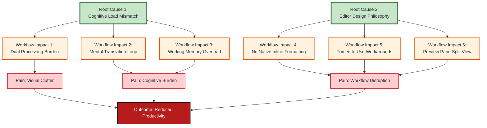

---

## 10. Summary and Key Insights

### 10.1 Workflow Summary

**Current State (As-Is):**
- **Three primary paths** exist, all with significant trade-offs
- **No path** provides inline formatting + native editing + standard file compatibility
- **Default path** (raw syntax) causes highest cognitive burden
- **Alternative paths** (preview, WYSIWYG) cause workflow disruption or compatibility issues

**Key Workflow Characteristics:**
1. **Fragmented Experience**: Users must choose between multiple imperfect solutions
2. **Constant Trade-offs**: Every path requires sacrificing something important
3. **Cognitive Overhead**: All paths require mental processing of syntax
4. **Workflow Disruption**: Alternative paths break editing flow

### 10.2 Critical Workflow Gaps

| Gap                            | Description                               | Impact                     |
| ------------------------------ | ----------------------------------------- | -------------------------- |
| **Gap 1: Inline Formatting**   | No native inline formatting visualization | High cognitive burden      |
| **Gap 2: Syntax Hiding**       | Syntax markers always visible             | Visual clutter             |
| **Gap 3: Native Editing**      | WYSIWYG solutions break native editing    | Loss of VS Code features   |
| **Gap 4: File Compatibility**  | WYSIWYG solutions require file conversion | Git/tooling conflicts      |
| **Gap 5: Workflow Continuity** | Preview panes break editing flow          | Context switching overhead |

### 10.3 Opportunity Identification

**The Ideal Workflow (To-Be):**
- ✅ Inline formatting visualization (hide syntax, show formatting)
- ✅ Native editing (preserve all VS Code features)
- ✅ Standard file format (no conversion, Git-friendly)
- ✅ Zero workflow disruption (edit in place)
- ✅ Low cognitive burden (no mental translation)

**This workflow does not exist in the current market.**

---

## 11. Next Steps

**Dependent Artifacts:**
- [PO3] Baseline Metrics - Quantify the workflow waste in hard numbers
- [ST1] Power/Interest Matrix - Identify stakeholders affected by broken workflow
- [ST2] User Personas - Detail user profiles experiencing workflow pain

**Related Artifacts:**
- [PO1] Root Cause Analysis - Identifies why the workflow is broken
- [BN2] To-Be Value Stream Map - Will map the optimized workflow

---

## References

- [PO1] Root Cause Analysis - [PO1-Root-Cause-Analysis.md](./PO1-Root-Cause-Analysis.md)
- [Problem Analysis](../additional-docs/00_Problem_Analysis.md)
- [Competitive Analysis](../additional-docs/01_Competitive_Analysis.md)

---

**Document Status:** ✅ Complete  
**Last Updated:** 2025-01-XX  
**Next Review:** After PO3 completion
