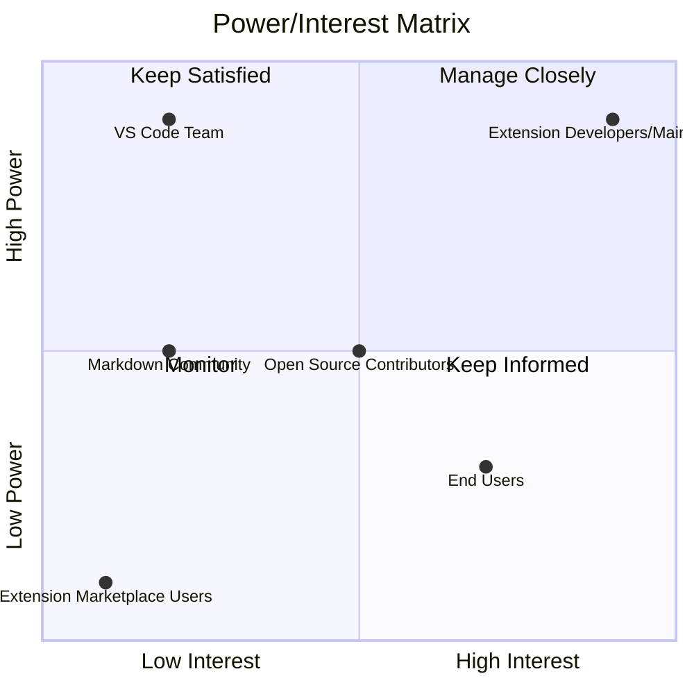

# Power/Interest Matrix
## ST1 - Power/Interest Matrix

**Project:** Markdown Inline Editor - VS Code Extension  
**Date:** 2025-01-XX  
**Status:** Active  
**UUID:** ST1  
**Dependent On:** PO1

---

## 1. Executive Summary

This document maps stakeholders by their **Power** (influence/authority) and **Interest** (engagement level) in the project. The matrix helps determine appropriate engagement strategies for each stakeholder group.

---

## 2. Power/Interest Matrix Visualization

---

## 3. Stakeholder Summary Table

| Stakeholder                                | Power  | Interest | Quadrant       | Engagement Strategy                                                     |
| ------------------------------------------ | ------ | -------- | -------------- | ----------------------------------------------------------------------- |
| **Extension Developers/Maintainers**       | High   | High     | Manage Closely | Core team, active development, direct decision-making                   |
| **End Users (Markdown Content Creators)**  | Medium | High     | Keep Informed  | Regular feedback collection, feature prioritization based on user needs |
| **Open Source Contributors**               | Medium | Medium   | Keep Informed  | Welcome contributions, clear contribution guidelines, responsive to PRs |
| **VS Code Team (Platform Provider)**       | High   | Low      | Keep Satisfied | Monitor API changes, ensure compatibility, follow best practices        |
| **Markdown Community (Standards/Tooling)** | Medium | Low      | Keep Satisfied | Maintain standard Markdown compatibility, follow spec compliance        |
| **Extension Marketplace Users**            | Low    | Low      | Monitor        | Monitor reviews and ratings, respond to feedback                        |

---

## 4. Engagement Strategy Details

### 4.1 Manage Closely (High Power, High Interest)

**Extension Developers/Maintainers**
- Direct involvement in all major decisions
- Regular communication and collaboration
- Access to all project information
- Primary responsibility for implementation

---

### 4.2 Keep Satisfied (High Power, Low Interest)

**VS Code Team (Platform Provider)**
- Monitor API changes, ensure compatibility, follow best practices
- Monitor VS Code API updates and changes
- Ensure extension compatibility with platform
- Follow VS Code extension development guidelines
- Minimal proactive engagement (they have many extensions to manage)

**Markdown Community (Standards/Tooling)**
- Maintain standard Markdown compatibility, follow spec compliance
- Ensure compliance with Markdown specifications (CommonMark, GFM)
- Monitor standard changes and updates
- Maintain compatibility with Markdown tooling ecosystem

---

### 4.3 Keep Informed (Low/Medium Power, High Interest)

**End Users (Markdown Content Creators)**
- Regular feedback collection, feature prioritization based on user needs
- Collect user feedback through GitHub issues, reviews
- Prioritize features based on user needs
- Regular communication about updates and changes
- User testing and validation

**Open Source Contributors**
- Welcome contributions, clear contribution guidelines, responsive to PRs
- Maintain clear contribution guidelines (CONTRIBUTING.md)
- Responsive to pull requests and issues
- Recognize and appreciate contributions
- Provide mentorship and guidance

---

### 4.4 Monitor (Low Power, Low Interest)

**Extension Marketplace Users**
- Monitor reviews and ratings, respond to feedback
- Monitor VS Code Marketplace reviews and ratings
- Respond to user feedback and issues
- Address critical bugs and concerns
- Minimal proactive engagement (passive monitoring)

---

## 5. Engagement Strategy Summary

| Quadrant | Stakeholders | Engagement Level | Communication Frequency |
|----------|--------------|------------------|------------------------|
| **Manage Closely** | Extension Developers/Maintainers | High | Daily/Weekly |
| **Keep Satisfied** | VS Code Team, Markdown Community | Medium | As needed / Quarterly |
| **Keep Informed** | End Users, Open Source Contributors | High | Weekly/Monthly |
| **Monitor** | Extension Marketplace Users | Low | As needed |

---

## 6. Power/Interest Definitions

### Power (Influence/Authority)
- **High Power:** Can significantly impact project success, control resources, or make critical decisions
- **Medium Power:** Can influence specific aspects of the project
- **Low Power:** Limited ability to influence project outcomes

### Interest (Engagement Level)
- **High Interest:** Actively engaged, provides feedback, uses the extension regularly
- **Medium Interest:** Moderate engagement, occasional feedback or contributions
- **Low Interest:** Minimal engagement, passive users or observers

---

## 7. Strategic Implications

### High Priority Stakeholders
1. **Extension Developers/Maintainers** - Core team, manage closely
2. **End Users** - Primary beneficiaries, keep informed and engaged

### Medium Priority Stakeholders
3. **Open Source Contributors** - Valuable contributors, keep informed
4. **VS Code Team** - Platform provider, keep satisfied
5. **Markdown Community** - Standards compliance, keep satisfied

### Low Priority Stakeholders
6. **Extension Marketplace Users** - Monitor for feedback and issues

---

## 8. Next Steps

**Dependent Artifacts:**
- [ST2] User Personas & RBAC - Detailed user profiles and role permissions
- [SC1] Security Requirements - May require stakeholder input

**Related Artifacts:**
- [PO1] Root Cause Analysis - Identifies stakeholders affected by the problem
- [PO2] Current State Analysis - Maps stakeholder workflows

---

## References

- [PO1] Root Cause Analysis - [PO1-Root-Cause-Analysis.md](./PO1-Root-Cause-Analysis.md)
- [ST2] User Personas & RBAC - [ST2-User-Personas-RBAC.md](./ST2-User-Personas-RBAC.md)
- [Problem Analysis](../additional-docs/00_Problem_Analysis.md)

---

**Document Status:** ✅ Complete  
**Last Updated:** 2025-01-XX  
**Next Review:** After ST2 completion
