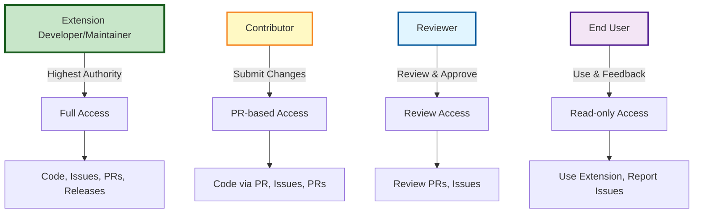
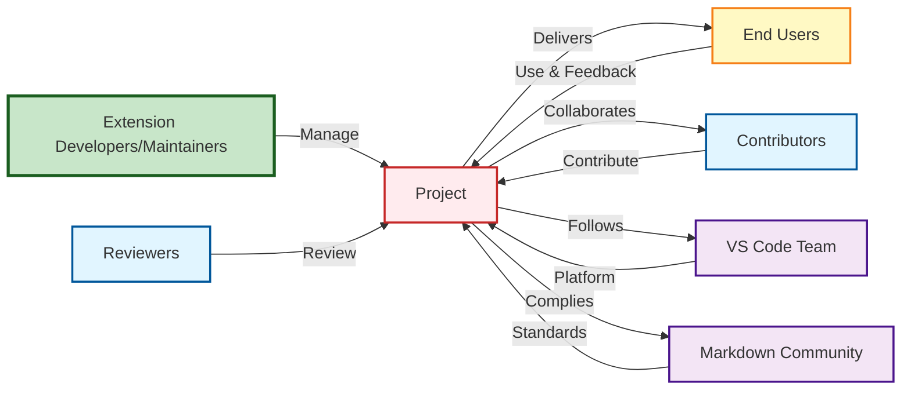

# RBAC Role Map
## ST3 - Role-Based Access Control

**Project:** Markdown Inline Editor - VS Code Extension  
**Date:** 2025-01-XX  
**Status:** Active  
**UUID:** ST3  
**Dependent On:** PO1

---

## 1. Executive Summary

This document defines roles and access permissions for the project. The RBAC (Role-Based Access Control) matrix maps specific permissions to roles, ensuring appropriate access levels for different stakeholder groups.

---

## 2. Role Definitions

| Role                               | Description              | Primary Responsibilities                                        |
| ---------------------------------- | ------------------------ | --------------------------------------------------------------- |
| **Extension Developer/Maintainer** | Core development team    | Code development, architecture decisions, releases, maintenance |
| **Contributor**                    | Open source contributors | Submit PRs, fix bugs, add features, review code                 |
| **Reviewer**                       | Code reviewers           | Review PRs, provide feedback, approve changes                   |
| **End User**                       | Extension users          | Use extension, provide feedback, report issues                  |

---

## 3. Access Permissions Matrix

| Permission                   | Extension Developer/Maintainer | Contributor | Reviewer | End User      |
| ---------------------------- | ------------------------------ | ----------- | -------- | ------------- |
| **Code Repository**          |
| Read code                    | ✅ Full                         | ✅ Full      | ✅ Full   | ✅ Public only |
| Write code                   | ✅ Full                         | ❌ (via PR)  | ❌        | ❌             |
| Merge PRs                    | ✅ Yes                          | ❌           | ❌        | ❌             |
| Create branches              | ✅ Yes                          | ✅ Yes       | ✅ Yes    | ❌             |
| Delete branches              | ✅ Yes                          | ❌           | ❌        | ❌             |
| **Issues & Discussions**     |
| Create issues                | ✅ Yes                          | ✅ Yes       | ✅ Yes    | ✅ Yes         |
| Comment on issues            | ✅ Yes                          | ✅ Yes       | ✅ Yes    | ✅ Yes         |
| Close issues                 | ✅ Yes                          | ✅ Yes       | ❌        | ❌             |
| **Pull Requests**            |
| Create PRs                   | ✅ Yes                          | ✅ Yes       | ✅ Yes    | ❌             |
| Review PRs                   | ✅ Yes                          | ✅ Yes       | ✅ Yes    | ❌             |
| Approve PRs                  | ✅ Yes                          | ❌           | ✅ Yes    | ❌             |
| Request changes              | ✅ Yes                          | ❌           | ✅ Yes    | ❌             |
| **Releases**                 |
| Create releases              | ✅ Yes                          | ❌           | ❌        | ❌             |
| Publish to marketplace       | ✅ Yes                          | ❌           | ❌        | ❌             |
| **Documentation**            |
| Edit docs                    | ✅ Yes                          | ✅ (via PR)  | ❌        | ❌             |
| **Settings & Configuration** |
| Modify settings              | ✅ Yes                          | ❌           | ❌        | ❌             |
| Manage CI/CD                 | ✅ Yes                          | ❌           | ❌        | ❌             |
| **Extension Usage**          |
| Install extension            | ✅ Yes                          | ✅ Yes       | ✅ Yes    | ✅ Yes         |
| Use extension                | ✅ Yes                          | ✅ Yes       | ✅ Yes    | ✅ Yes         |
| Report bugs                  | ✅ Yes                          | ✅ Yes       | ✅ Yes    | ✅ Yes         |
| Request features             | ✅ Yes                          | ✅ Yes       | ✅ Yes    | ✅ Yes         |

---

## 4. Role Hierarchy

---

## 5. Permission Details

### 5.1 Extension Developer/Maintainer

**Access Level:** Full Administrative
- Full administrative access to repository
- Can merge PRs, create releases, publish to marketplace
- Responsible for architecture decisions and maintenance
- Manages CI/CD pipelines and project settings

**Key Permissions:**
- Direct code write access
- PR merge authority
- Release creation and publishing
- Repository settings management

---

### 5.2 Contributor

**Access Level:** PR-based Contribution
- Can create branches and submit PRs
- Can create and comment on issues
- Cannot merge PRs or create releases
- Follows contribution guidelines (CONTRIBUTING.md)

**Key Permissions:**
- Branch creation
- PR submission
- Issue creation and commenting
- Code review participation

---

### 5.3 Reviewer

**Access Level:** Review and Approval
- Can review and approve PRs
- Can request changes on PRs
- Can create and comment on issues
- Cannot write code directly (must use PRs)

**Key Permissions:**
- PR review and approval
- Change request authority
- Issue participation
- No direct code write access

---

### 5.4 End User

**Access Level:** Read-only and Feedback
- Can install and use the extension
- Can create issues and provide feedback
- Can request features
- Read-only access to public repository

**Key Permissions:**
- Extension installation and usage
- Issue creation
- Feature requests
- Public repository read access

---

## 6. Stakeholder Interaction Map

---

## 7. Security Considerations

### 7.1 Access Control Principles

- **Principle of Least Privilege:** Users receive minimum permissions necessary for their role
- **Separation of Duties:** Critical operations (merge, release) require maintainer role
- **Audit Trail:** All repository actions are logged and traceable
- **Regular Review:** Role assignments reviewed periodically

### 7.2 Permission Escalation

- Contributors cannot escalate to maintainer without explicit assignment
- Reviewers have approval authority but cannot merge without maintainer
- End users have no code access, only feedback channels

---

## 8. Next Steps

**Dependent Artifacts:**
- [SC1] Security Requirements - RBAC informs security requirements
- [SC3] Security Controls Matrix - Access controls mapped to security controls

**Related Artifacts:**
- [ST1] Power/Interest Matrix - [ST1-Power-Interest-Matrix.md](./ST1-Power-Interest-Matrix.md)
- [ST2] User Personas - [ST2-User-Personas.md](./ST2-User-Personas.md)
- [PO1] Root Cause Analysis - Identifies stakeholder roles

---

## References

- [ST1] Power/Interest Matrix - [ST1-Power-Interest-Matrix.md](./ST1-Power-Interest-Matrix.md)
- [ST2] User Personas - [ST2-User-Personas.md](./ST2-User-Personas.md)
- [PO1] Root Cause Analysis - [PO1-Root-Cause-Analysis.md](./PO1-Root-Cause-Analysis.md)
- [Problem Analysis](../additional-docs/00_Problem_Analysis.md)

---

**Document Status:** ✅ Complete  
**Last Updated:** 2025-01-XX  
**Next Review:** After SC1 completion
