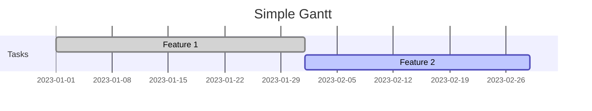
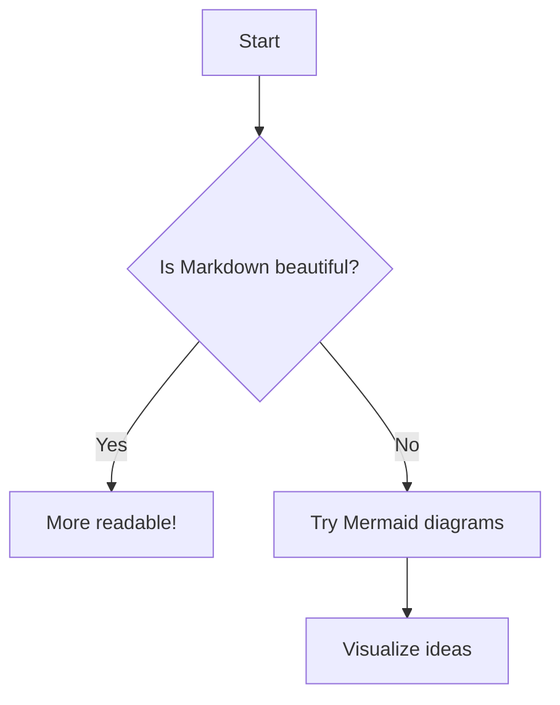

## gantt mermaid chart

```mermaid
gantt
title Simple Gantt
dateFormat  YYYY-MM-DD
section Tasks
Feature 1      :done,    task1, 2023-01-01, 2023-02-01
Feature 2      :active,  task2, 2023-02-01, 2023-03-01
``` 

## sequence mermaid chart

```mermaid
graph TD
A[Start] --> B{Is Markdown beautiful?}
B -- Yes --> C[More readable!]
B -- No --> D[Try Mermaid diagrams]
D --> E[Visualize ideas]
``` 

