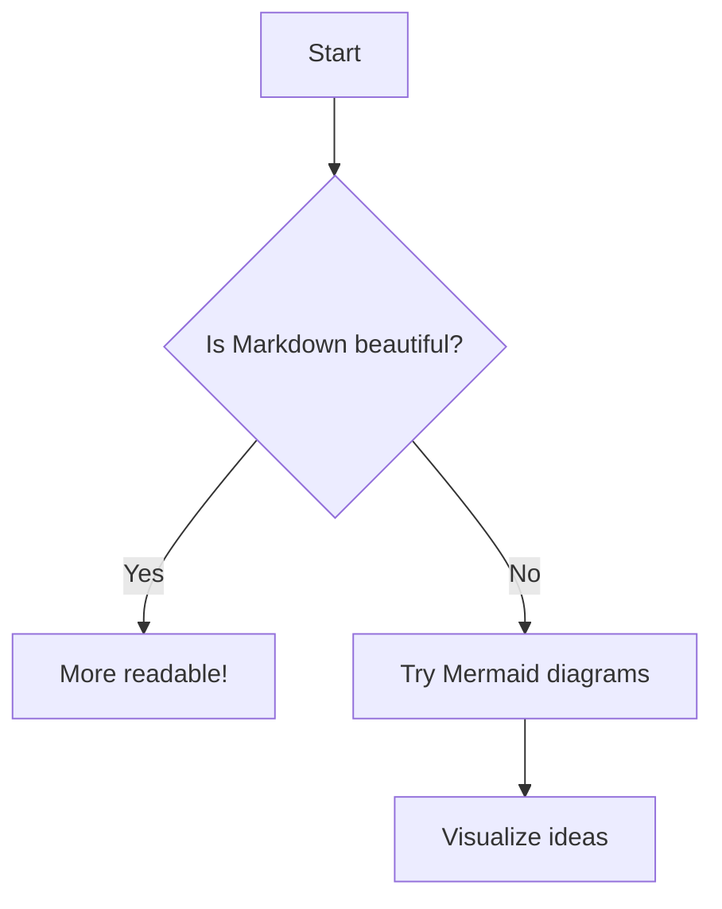
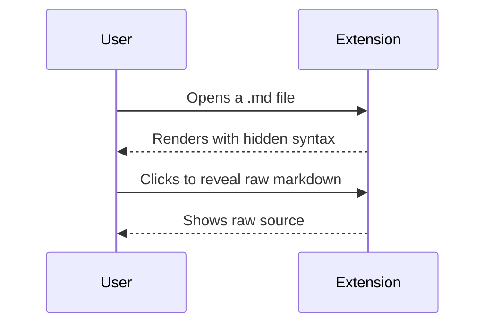
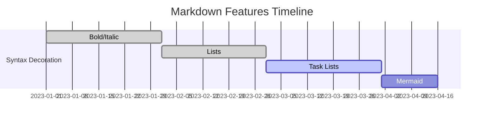

# Markdown Example - UAT Checklist 

## Syntax Shadowing System - Testing Guide

The extension uses a 3-state model for markdown syntax visibility:

### States:
- **Rendered (default)**: Syntax markers are hidden, only formatted content is visible 
UAT-CHECK(x)
- **Ghost**: When cursor is on a line with markdown syntax but NOT inside the construct - markers show at reduced opacity. can be changed in the settings 
UAT-CHECK(x)
- **Raw**: When cursor/selection is inside or at boundaries of a construct - markers show fully visible 
UAT-CHECK(x)

### Testing Checklist for Each Example:

For each example below, verify the following behaviors:

**Rendered state**: When cursor is away from the construct, syntax markers are hidden 
UAT-CHECK(x)
**Ghost state**: When cursor is on the same line but outside the construct, markers show faintly (30% opacity) 
UAT-CHECK(x)
**Raw state**: When cursor is inside the construct or at its boundaries (start/end), markers show fully visible 
UAT-CHECK(x)
**Raw state with selection**: When text is selected covering the construct, markers show fully visible 
UAT-CHECK(x)
**Semantic styling preserved**: Formatting (bold, italic, etc.) remains visible in all states 
UAT-CHECK(x)
**Boundary detection**: Cursor right after closing marker shows raw state (not ghost) 
UAT-CHECK(x)
**Boundary detection**: Cursor at opening marker shows raw state (not ghost) 
UAT-CHECK(x)

---

## Font Styles

**Bold text with asterisks** 
UAT-CHECK(x)
__Bold text with underscores__ 
UAT-CHECK(x)

*Italic text with asterisk* 
UAT-CHECK(x)
_Italic text with underscore_ 
UAT-CHECK(x)

***Bold and italic text with triple asterisks*** 
UAT-CHECK(x)
___Bold and italic text with triple underscores___ 
UAT-CHECK(x)

~~Strikethrough text~~ 
UAT-CHECK(x)
`simple inline code` 
UAT-CHECK(x)

`code with spaces` 
UAT-CHECK()

`` `code` with backticks inside `` 
UAT-CHECK(x)
````Here is some ``inline `code` inside backticks```` 
UAT-CHECK(x)

## Sequential Font Styles Examples

**Bold** *Italic* ~~Strikethrough~~ 
UAT-CHECK(x)
__Bold__ _Italic_ `Inline code` 
UAT-CHECK(x)
**Bold** *Italic* ~~Strikethrough~~ `Code` 
UAT-CHECK(x)
~~Strikethrough~~ **Bold** *Italic* 
UAT-CHECK(x)
*Italic* `Code` __Bold__ 
UAT-CHECK(x)
`Code` ~~Strikethrough~~ *Italic* 
UAT-CHECK(x)
**Bold** *Italic* ~~Strikethrough~~ `Code block` 
UAT-CHECK(x)
[**Bold link**](https://example.com) *Italic* `inline code` 
UAT-CHECK(x)
~~Strikethrough~~ [__Bold link__](https://example.com) *Italic* `Code` 
UAT-CHECK(x)

---

## Nested Combinations

**Bold with *italic* inside** 
UAT-CHECK(x)
*Italic with **bold** inside* 
UAT-CHECK(x)
***Bold and italic combined*** 
UAT-CHECK(x)
**_Bold and italic (nested underscore syntax)_** 
UAT-CHECK(x)

~~**Bold in strikethrough**~~ 
UAT-CHECK(x)
~~*Italic in strikethrough*~~ 
UAT-CHECK(x)
**~~Bold and strikethrough (nested)~~** 
UAT-CHECK(x)
**~~Bold, Italic, and Strikethrough, and then `code`~~_** 
UAT-CHECK(x)

[**Bold** link text](https://example.com) 
UAT-CHECK(x)
[*Italic* link text](https://example.com) 
UAT-CHECK(x)
[~~Strikethrough~~ link text](https://example.com) 
UAT-CHECK(x)
[`Code` in link text](https://example.com) 
UAT-CHECK(x)
[**Bold** and *italic* combined](https://example.com) 
UAT-CHECK(x)

 
UAT-CHECK(x)
 
UAT-CHECK(x)

`**bold** inside code` (should show literal asterisks) 
UAT-CHECK(x)
`*italic* inside code` (should show literal asterisks) 
UAT-CHECK(x)
`~~strikethrough~~ inside code` (should show literal tildes) 
UAT-CHECK(x)

---

## Stacked Markdown Styles

# H1 with **bold** text 
UAT-CHECK(x)

## H2 with *italic* text 
UAT-CHECK(x)

### H3 with ~~strikethrough~~ text 
UAT-CHECK(x)

#### H4 with `inline code` 
UAT-CHECK(x)

##### H5 with [link text](https://example.com) 
UAT-CHECK(x)

###### H6 with **bold** and *italic* combined 
UAT-CHECK(x)

- Item with **bold** text 
UAT-CHECK(x)
- Item with *italic* text 
UAT-CHECK(x)
- Item with ~~strikethrough~~ text 
UAT-CHECK(x)
- Item with `inline code` 
UAT-CHECK(x)
- Item with [link](https://example.com) 
UAT-CHECK(x)

* Item with **bold** and *italic* 
UAT-CHECK(x)
* Item with `code` and [link](https://example.com) 
UAT-CHECK(x)

+ Item with **bold** text 
UAT-CHECK(x)
+ Item with *italic* text 
UAT-CHECK(x)

- Parent item with **bold** 
UAT-CHECK(x)
  - Nested item with *italic* 
UAT-CHECK(x)
    - Deeply nested with `code` 
UAT-CHECK(x)
- Another parent 
UAT-CHECK(x)
  - Nested with [link](https://example.com) 
UAT-CHECK(x)

- Item 
UAT-CHECK(x)
- - Nested item 
UAT-CHECK(x)

1. First item with **bold** text 
UAT-CHECK(x)
2. Second item with *italic* text 
UAT-CHECK(x)
3. Third item with ~~strikethrough~~ text 
UAT-CHECK(x)
4. Fourth item with `inline code` 
UAT-CHECK(x)
5. Fifth item with [link](https://example.com) 
UAT-CHECK(x)

1) First item with **bold** 
UAT-CHECK(x)
2) Second item with *italic* 
UAT-CHECK(x)
3) Third item with `code` 
UAT-CHECK(x)

10. Tenth item with **bold** 
UAT-CHECK(x)
11. Eleventh item with *italic* 
UAT-CHECK(x)
12. Twelfth item with [link](https://example.com) 
UAT-CHECK(x)

1. Parent item 
UAT-CHECK(x)
   1. Nested item 
UAT-CHECK(x)
      1. Deeply nested item 
UAT-CHECK(x)
2. Another parent 
UAT-CHECK(x)

- [x] Completed task with **bold** text 
UAT-CHECK(x)
- [ ] Unchecked task with *italic* text 
UAT-CHECK(x)
- [ ] Task with `inline code` 
UAT-CHECK(x)
- [ ] Task with [link](https://example.com) 
UAT-CHECK(x)

* [x] Completed task with **bold** 
UAT-CHECK(x)
* [ ] Unchecked task with *italic* 
UAT-CHECK(x)

+ [x] Completed task 
UAT-CHECK(x)
+ [ ] Unchecked task with `code` 
UAT-CHECK(x)

1. [x] Completed ordered task with **bold** 
UAT-CHECK(x)
2. [ ] Unchecked ordered task with *italic* 
UAT-CHECK(x)
3. [x] Another completed task with `code` 
UAT-CHECK(x)

1) [x] Completed task 
UAT-CHECK(x)
2) [ ] Unchecked task with **bold** 
UAT-CHECK(x)

> Quote text with **bold** formatting 
UAT-CHECK(x)

> Quote text with *italic* formatting 
UAT-CHECK(x)

> Quote text with `inline code` 
UAT-CHECK(x)

> Quote text with [link](https://example.com) 
UAT-CHECK(x)

> Outer quote with **bold** 
UAT-CHECK(x)
> > Nested quote with *italic* 
UAT-CHECK(x)
> > > Deeply nested quote with `code` 
UAT-CHECK(x)

---
UAT-CHECK(x)
*** 
UAT-CHECK(x)
___ 
UAT-CHECK(x)

------- 
UAT-CHECK(x)
******** 
UAT-CHECK(x)

## Headings

Markdown supports six levels of headings, using hash symbols (`#`) from `#` (H1) to `######` (H6).

# Heading Level 1
UAT-CHECK(x)
## Heading Level 2
UAT-CHECK(x)
### Heading Level 3
UAT-CHECK(x)
#### Heading Level 4
UAT-CHECK(x)
##### Heading Level 5
UAT-CHECK(x)
###### Heading Level 6
UAT-CHECK(x)

Ensure that syntax markers for headings (`#`, `##`, etc.) respond to the 3-state model:

- **Rendered**: Hashes hidden, only heading text styled by level.
- **Ghost**: Hashes appear faint when the cursor is on the heading's line but not inside the marker area.
- **Raw**: Hashes are fully visible when the cursor is inside or at the boundary of the heading marker.

**Test stacking other markdown inside headings:**

# Heading with **bold** and *italic*
UAT-CHECK(x)

## Heading with `inline code` and [link](https://example.com)
UAT-CHECK(x)

### Heading with ~~strikethrough~~
UAT-CHECK(x)

# `some code` test **bold**
UAT-CHECK(x)
---

## Code Blocks

```python
print("Hello, World!")
def example():
    return True
```
UAT-CHECK(x)

```
plain code block
no language specified
```
UAT-CHECK(x)

````markdown
Here is some ```code``` inside
And also ``inline `code` `` examples
````
UAT-CHECK(x)

```javascript
function hello() {
  console.log("Hello, World!");
}
```
UAT-CHECK(x)

---

## Basic Markdown Smoke Test

# Document Title 
UAT-CHECK(x)

This is a paragraph with **bold**, *italic*, ~~strikethrough~~, `inline code`, and a [link to example.com](https://example.com). 
UAT-CHECK(x)

## Section Heading 
UAT-CHECK(x)

Here's an image:  
UAT-CHECK(?)

- Unordered list item 1 
UAT-CHECK(x)
- Unordered list item 2 with **bold** 
UAT-CHECK(x)
- Nested list root
  - Nested item with *italic* 
UAT-CHECK(x)

1. Ordered list item 1 
UAT-CHECK(x)
1. Ordered list item 1
2. Ordered list item 2 with `code` 
UAT-CHECK(x)
1. Ordered list item 1
2. Ordered list item 2 with `code` 
3. Ordered list item 3 with [link](https://example.com) 
UAT-CHECK(x)

- [x] Completed task 
UAT-CHECK(x)
- [ ] Unchecked task 
UAT-CHECK(x)
- [ ] Clickable checkbox list item
UAT-CHECK(x)


> This is a blockquote with **bold** text 
UAT-CHECK(x)
> Nested blockquote root 
> > Nested blockquote with *italic* text 
UAT-CHECK(x)

---

```python
# Code block example
def example():
    return "Hello, World!"
``` 
UAT-CHECK(x)

---

## Math (LaTeX) — TODO

```latex
\begin{align}
E &= mc^2 \\[10pt]
a^2 + b^2 &= c^2 \\[10pt]
\int_0^\infty e^{-x^2} \, dx &= \frac{\sqrt{\pi}}{2} \\[18pt]
\text{Euler's Identity:} \quad e^{i\pi} + 1 &= 0 \\[10pt]
\text{Quadratic Formula:} \quad x &= \frac{ -b \pm \sqrt{b^2 - 4ac} }{2a} \\[18pt]
\text{Taylor Series for } e^x: \quad e^x &= \sum_{n=0}^{\infty} \frac{x^n}{n!}
\end{align}
``` 
UAT-CHECK()

```math
\sum_{n=1}^{\infty} \frac{1}{n^2} = \frac{\pi^2}{6}
``` 
UAT-CHECK()

- Euler's identity: $e^{i\pi} + 1 = 0$
UAT-CHECK()
- Physics: Force $F = ma$, Greek: $A = \pi r^2$
UAT-CHECK()
- Function: $ f(x)=\int_{-\infty}^{\infty}e^{-x^2}dx $
UAT-CHECK()

$$
f(x) = \int_{-\infty}^{\infty} e^{-x^2} dx
$$ 
UAT-CHECK()

**Note:** Use `\$` for a regular dollar sign when math is implemented.

---

## Appendix: TODO / Not Implemented Yet

| A   | B   |
| --- | --- |
| X   | Y   |
UAT-CHECK()

| A   | :--- | ---: | :-: |
| --- | ---- | ---- | --- |
| L   | left | r    | c   |
UAT-CHECK()

| Inline <sub>HTML</sub> | **Bold** | `Code` |
| :--------------------: | -------: | :----: |
|          Some          |  **Row** | `Data` |
UAT-CHECK()

| Multi<br>Line | Pipe&#124;In Cell | Escaped \| literal | 
|--------------|-------------------|---------------------| 
| a<br>b | value\|2 | \| yes \| | 
| Empty Col | | Trailing | 
UAT-CHECK()

<https://github.com> 
UAT-CHECK()
www.example.com 
UAT-CHECK()
user@example.com 
UAT-CHECK()

:smile: :+1: :tada: :not-an-emoji: 
UAT-CHECK()

@octocat #42 repo#99 
UAT-CHECK()


UAT-CHECK()


UAT-CHECK()


UAT-CHECK()

~~~js
console.log("Tilde fence, GFM");
~~~ 
UAT-CHECK()

<pre>
* GFM allows HTML *in text*
</pre> 
UAT-CHECK()

- [] Missing space after bracket for checkbox (invalid) 
UAT-CHECK()
- [x]Task missing space after checkbox (invalid) 
UAT-CHECK()
- [*] Not valid GFM (should not check) 
UAT-CHECK()

~not strikethrough~ (single tilde, not valid) 
UAT-CHECK(x)
~~GFM strikethrough~~ (valid) 
UAT-CHECK(x)
foo~~bar~~baz (strikethrough in middle of word) 
UAT-CHECK(x)
