# Markdown Example - UAT Checklist

## Syntax Shadowing System - Testing Guide

The extension uses a 3-state model for markdown syntax visibility:

### States:
- **Rendered (default)**: Syntax markers are hidden, only formatted content is visible 
UAT-CHECK()
- **Ghost**: When cursor is on a line with markdown syntax but NOT inside the construct - markers show at reduced opacity. can be changed in the settings 
UAT-CHECK()
- **Raw**: When cursor/selection is inside or at boundaries of a construct - markers show fully visible 
UAT-CHECK()

### Testing Checklist for Each Example:

For each example below, verify the following behaviors:

**Rendered state**: When cursor is away from the construct, syntax markers are hidden 
UAT-CHECK()
**Ghost state**: When cursor is on the same line but outside the construct, markers show faintly (30% opacity) 
UAT-CHECK()
**Raw state**: When cursor is inside the construct or at its boundaries (start/end), markers show fully visible 
UAT-CHECK()
**Raw state with selection**: When text is selected covering the construct, markers show fully visible 
UAT-CHECK()
**Semantic styling preserved**: Formatting (bold, italic, etc.) remains visible in all states 
UAT-CHECK()
**Boundary detection**: Cursor right after closing marker shows raw state (not ghost) 
UAT-CHECK()
**Boundary detection**: Cursor at opening marker shows raw state (not ghost) 
UAT-CHECK()

---


## Basic Markdown Smoke Test

# Document Title

This is a paragraph with **bold**, *italic*, ~~strikethrough~~, `inline code`, and a [link to example.com](https://example.com).

## Section Heading

Here's an image: 

- Unordered list item 1
- Unordered list item 2 with **bold**
- Nested list root
  - Nested item with *italic*

1. Ordered list item 1
1. Ordered list item 1
2. Ordered list item 2 with `code`
1. Ordered list item 1
2. Ordered list item 2 with `code`
3. Ordered list item 3 with [link](https://example.com)

- [x] Completed task
- [ ] Unchecked task
- [x] Clickable checkbox list item
- [] Unchecked (GFM, missing space)
-[ ] Unchecked (GFM, missing left space)
- [ ] Unchecked, extra space after bracket
- [ x] Checked, extra space before "x"
- [X] Checked, uppercase X
- [ ] multiple   spaces after box
- [ ]	Tabbed space after box
- [  ] Blank space between brackets (not valid GFM)
- [y] alpha instead of x -- should not check (not valid)
- [*] asterisk instead of x -- should not check (not valid)
- [ 	x] Tab and space
- [x ] Checked, space after x
- [X ] Checked, uppercase X, space after X
- [  x ] Checked, multiple spaces before x and after
- [] Not checked, GFM empty box, no space after bracket
-	[ ] Indented unchecked checkbox (GFM)
1. [x] Numbered task
2. [ ] Numbered task, unchecked
- [x] Task inside list (checked)
- [ ] Task inside list (unchecked)
- [x] Task with emoji :tada: checked
- [ ] Task with emoji :cry: unchecked

> This is a blockquote with **bold** text
> Nested blockquote root
> > Nested blockquote with *italic* text

```python
# Code block example
def example():
    return "Hello, World!"
``` 

---


## Font Styles

**Bold text with asterisks** 
UAT-CHECK()
__Bold text with underscores__ 
UAT-CHECK()

*Italic text with asterisk* 
UAT-CHECK()
_Italic text with underscore_ 
UAT-CHECK()

***Bold and italic text with triple asterisks*** 
UAT-CHECK()
___Bold and italic text with triple underscores___ 
UAT-CHECK()

~~Strikethrough text~~ 
UAT-CHECK()
`simple inline code` 
UAT-CHECK()

`code with spaces` 
UAT-CHECK()

`` `code` with backticks inside `` 
UAT-CHECK()
````Here is some ``inline `code` inside backticks```` 
UAT-CHECK()

## Sequential Font Styles Examples

**Bold** *Italic* ~~Strikethrough~~ 
UAT-CHECK()
__Bold__ _Italic_ `Inline code` 
UAT-CHECK()
**Bold** *Italic* ~~Strikethrough~~ `Code` 
UAT-CHECK()
~~Strikethrough~~ **Bold** *Italic* 
UAT-CHECK()
*Italic* `Code` __Bold__ 
UAT-CHECK()
`Code` ~~Strikethrough~~ *Italic* 
UAT-CHECK()
**Bold** *Italic* ~~Strikethrough~~ `Code block` 
UAT-CHECK()
[**Bold link**](https://example.com) *Italic* `inline code` 
UAT-CHECK()
~~Strikethrough~~ [__Bold link__](https://example.com) *Italic* `Code` 
UAT-CHECK()

---

## Nested Combinations

**Bold with *italic* inside** 
UAT-CHECK()
*Italic with **bold** inside* 
UAT-CHECK()
***Bold and italic combined*** 
UAT-CHECK()
**_Bold and italic (nested underscore syntax)_** 
UAT-CHECK()

~~**Bold in strikethrough**~~ 
UAT-CHECK()
~~*Italic in strikethrough*~~ 
UAT-CHECK()
**~~Bold and strikethrough (nested)~~** 
UAT-CHECK()
**~~Bold, Italic, and Strikethrough, and then `code`~~_** 
UAT-CHECK()

[**Bold** link text](https://example.com) 
UAT-CHECK()
[*Italic* link text](https://example.com) 
UAT-CHECK()
[~~Strikethrough~~ link text](https://example.com) 
UAT-CHECK()
[`Code` in link text](https://example.com) 
UAT-CHECK()
[**Bold** and *italic* combined](https://example.com) 
UAT-CHECK()

 
UAT-CHECK()
 
UAT-CHECK()

`**bold** inside code` (should show literal asterisks) 
UAT-CHECK()
`*italic* inside code` (should show literal asterisks) 
UAT-CHECK()
`~~strikethrough~~ inside code` (should show literal tildes) 
UAT-CHECK()

---

## Stacked Markdown Styles

# H1 with **bold** text 
UAT-CHECK()

## H2 with *italic* text 
UAT-CHECK()

### H3 with ~~strikethrough~~ text 
UAT-CHECK()

#### H4 with `inline code` 
UAT-CHECK()

##### H5 with [link text](https://example.com) 
UAT-CHECK()

###### H6 with **bold** and *italic* combined 
UAT-CHECK()

- Item with **bold** text 
UAT-CHECK()
- Item with *italic* text 
UAT-CHECK()
- Item with ~~strikethrough~~ text 
UAT-CHECK()
- Item with `inline code` 
UAT-CHECK()
- Item with [link](https://example.com) 
UAT-CHECK()

* Item with **bold** and *italic* 
UAT-CHECK()
* Item with `code` and [link](https://example.com) 
UAT-CHECK()

+ Item with **bold** text 
UAT-CHECK()
+ Item with *italic* text 
UAT-CHECK()

- Parent item with **bold** 
UAT-CHECK()
  - Nested item with *italic* 
UAT-CHECK()
    - Deeply nested with `code` 
UAT-CHECK()
- Another parent 
UAT-CHECK()
  - Nested with [link](https://example.com) 
UAT-CHECK()

- Item 
UAT-CHECK()
- - Nested item 
UAT-CHECK()

1. First item with **bold** text 
UAT-CHECK()
2. Second item with *italic* text 
UAT-CHECK()
3. Third item with ~~strikethrough~~ text 
UAT-CHECK()
4. Fourth item with `inline code` 
UAT-CHECK()
5. Fifth item with [link](https://example.com) 
UAT-CHECK()

1) First item with **bold** 
UAT-CHECK()
2) Second item with *italic* 
UAT-CHECK()
3) Third item with `code` 
UAT-CHECK()

10. Tenth item with **bold** 
UAT-CHECK()
11. Eleventh item with *italic* 
UAT-CHECK()
12. Twelfth item with [link](https://example.com) 
UAT-CHECK()

1. Parent item 
UAT-CHECK()
   1. Nested item 
UAT-CHECK()
      1. Deeply nested item 
UAT-CHECK()
2. Another parent 
UAT-CHECK()

- [x] Completed task with **bold** text 
UAT-CHECK()
- [ ] Unchecked task with *italic* text 
UAT-CHECK()
- [ ] Task with `inline code` 
UAT-CHECK()
- [ ] Task with [link](https://example.com) 
UAT-CHECK()

* [x] Completed task with **bold** 
UAT-CHECK()
* [ ] Unchecked task with *italic* 
UAT-CHECK()

+ [x] Completed task 
UAT-CHECK()
+ [ ] Unchecked task with `code` 
UAT-CHECK()

1. [x] Completed ordered task with **bold** 
UAT-CHECK()
2. [ ] Unchecked ordered task with *italic* 
UAT-CHECK()
3. [x] Another completed task with `code` 
UAT-CHECK()

1) [x] Completed task 
UAT-CHECK()
2) [ ] Unchecked task with **bold** 
UAT-CHECK()

> Quote text with **bold** formatting 
UAT-CHECK()

> Quote text with *italic* formatting 
UAT-CHECK()

> Quote text with `inline code` 
UAT-CHECK()

> Quote text with [link](https://example.com) 
UAT-CHECK()

> Outer quote with **bold** 
> > Nested quote with *italic* 
> > > Deeply nested quote with `code` 
UAT-CHECK()

---
UAT-CHECK()
*** 
UAT-CHECK()
___ 
UAT-CHECK()

------- 
UAT-CHECK()
******** 
UAT-CHECK()

## Headings

Markdown supports six levels of headings, using hash symbols (`#`) from `#` (H1) to `######` (H6).

# Heading Level 1
UAT-CHECK()
## Heading Level 2
UAT-CHECK()
### Heading Level 3
UAT-CHECK()
#### Heading Level 4
UAT-CHECK()
##### Heading Level 5
UAT-CHECK()
###### Heading Level 6
UAT-CHECK()

Ensure that syntax markers for headings (`#`, `##`, etc.) respond to the 3-state model:

- **Rendered**: Hashes hidden, only heading text styled by level.
- **Ghost**: Hashes appear faint when the cursor is on the heading's line but not inside the marker area.
- **Raw**: Hashes are fully visible when the cursor is inside or at the boundary of the heading marker.

**Test stacking other markdown inside headings:**

# Heading with **bold** and *italic*
UAT-CHECK()

## Heading with `inline code` and [link](https://example.com)
UAT-CHECK()

### Heading with ~~strikethrough~~
UAT-CHECK()

# `some code` test **bold**
UAT-CHECK()


# some heading
UAT-CHECK()
---

## Code Blocks

```python
print("Hello, World!")
def example():
    return True
```
UAT-CHECK()

```
plain code block
no language specified
```
UAT-CHECK()

````markdown
Here is some ```code``` inside
And also ``inline `code` `` examples
````
UAT-CHECK()

```javascript
function hello() {
  console.log("Hello, World!");
}
```
UAT-CHECK()

---

## Math (LaTeX) — TODO

```latex
\begin{align}
E &= mc^2 \\[10pt]
a^2 + b^2 &= c^2 \\[10pt]
\int_0^\infty e^{-x^2} \, dx &= \frac{\sqrt{\pi}}{2} \\[18pt]
\text{Euler's Identity:} \quad e^{i\pi} + 1 &= 0 \\[10pt]
\text{Quadratic Formula:} \quad x &= \frac{ -b \pm \sqrt{b^2 - 4ac} }{2a} \\[18pt]
\text{Taylor Series for } e^x: \quad e^x &= \sum_{n=0}^{\infty} \frac{x^n}{n!}
\end{align}
``` 
UAT-CHECK()

```math
\sum_{n=1}^{\infty} \frac{1}{n^2} = \frac{\pi^2}{6}
``` 
UAT-CHECK()

- Euler's identity: $e^{i\pi} + 1 = 0$
UAT-CHECK()
- Physics: Force $F = ma$, Greek: $A = \pi r^2$
UAT-CHECK()
- Function: $ f(x)=\int_{-\infty}^{\infty}e^{-x^2}dx $
UAT-CHECK()

$$
f(x) = \int_{-\infty}^{\infty} e^{-x^2} dx
$$ 
UAT-CHECK()

**Note:** Use `\$` for a regular dollar sign when math is implemented.

---

## Appendix: TODO / Not Implemented Yet

| A   | B   |
| --- | --- |
| X   | Y   |
UAT-CHECK()

| A   | :--- | ---: | :-: |
| --- | ---- | ---- | --- |
| L   | left | r    | c   |
UAT-CHECK()

| Inline <sub>HTML</sub> | **Bold** | `Code` |
| :--------------------: | -------: | :----: |
|          Some          |  **Row** | `Data` |
UAT-CHECK()

| Multi<br>Line | Pipe&#124;In Cell | Escaped \| literal |
| ------------- | ----------------- | ------------------ |
| a<br>b        | value\|2          | \| yes \|          |
| Empty Col     |                   | Trailing           |
UAT-CHECK()

<https://github.com>
UAT-CHECK()
www.example.com
UAT-CHECK()
user@example.com
UAT-CHECK()

:smile: :+1: :tada: :not-an-emoji: 
UAT-CHECK()

@octocat #42 repo#99 
UAT-CHECK()

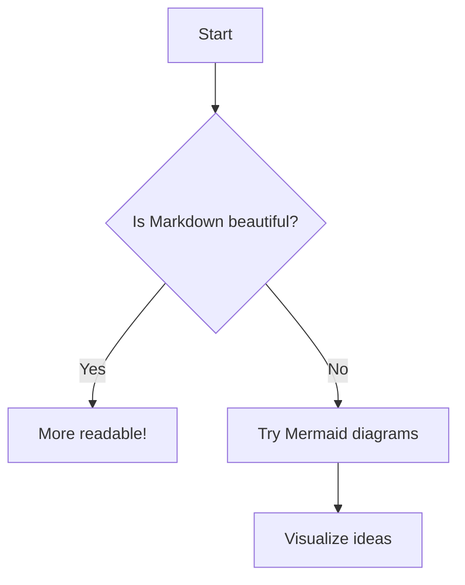
UAT-CHECK()

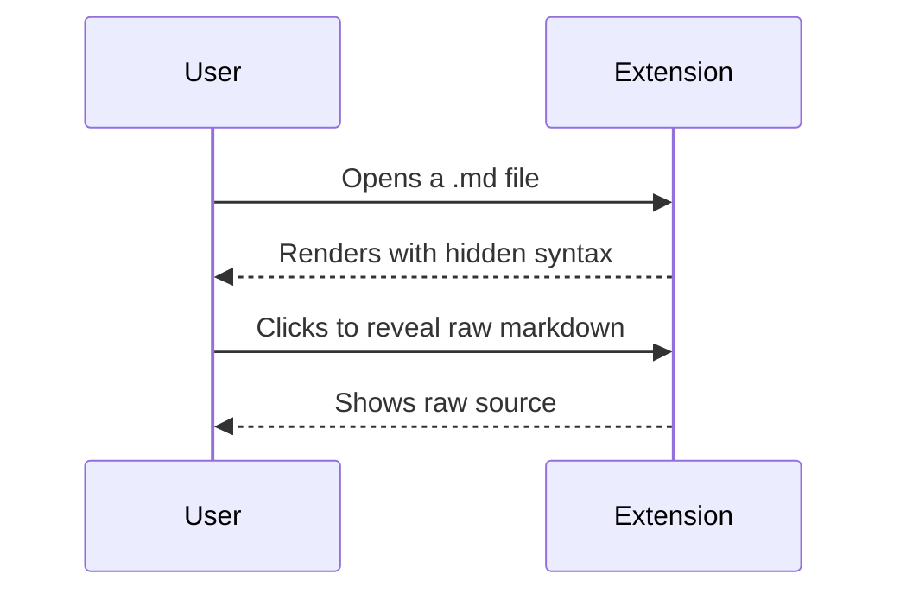
UAT-CHECK()

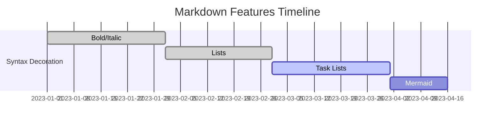
UAT-CHECK()

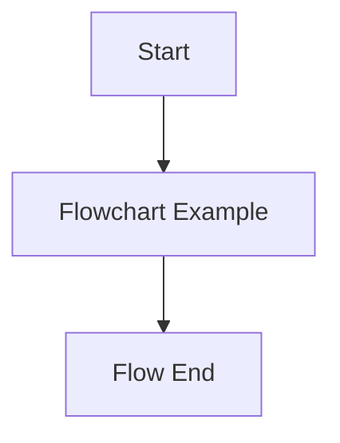
UAT-CHECK()

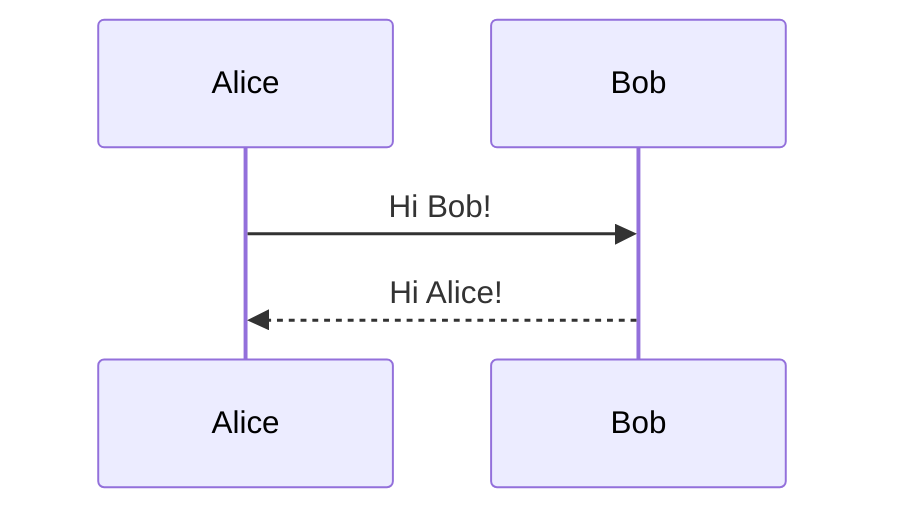
UAT-CHECK()

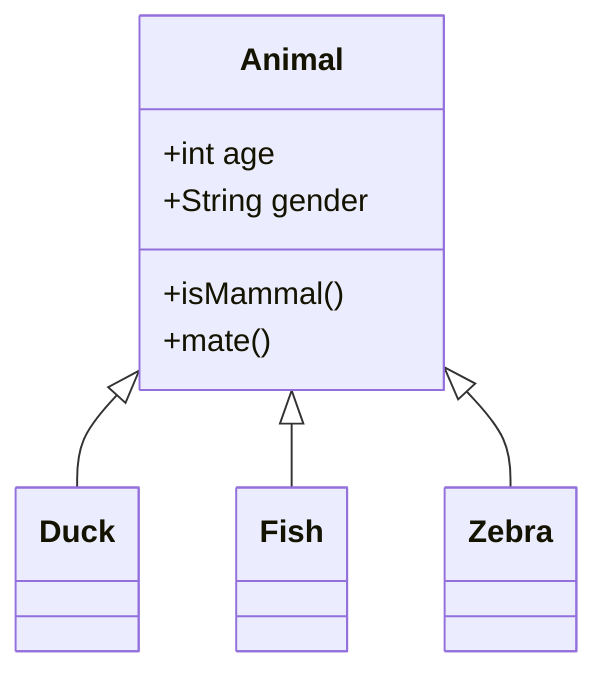
UAT-CHECK()

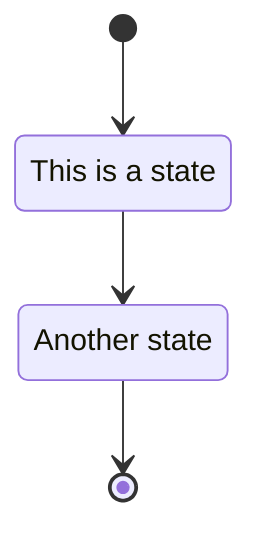
UAT-CHECK()

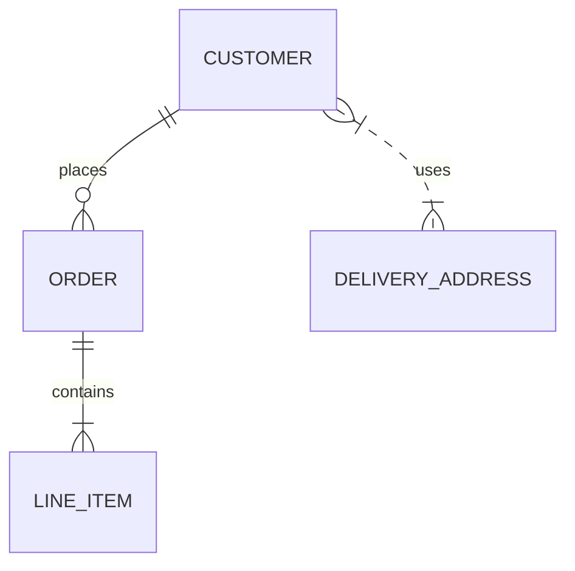
UAT-CHECK()

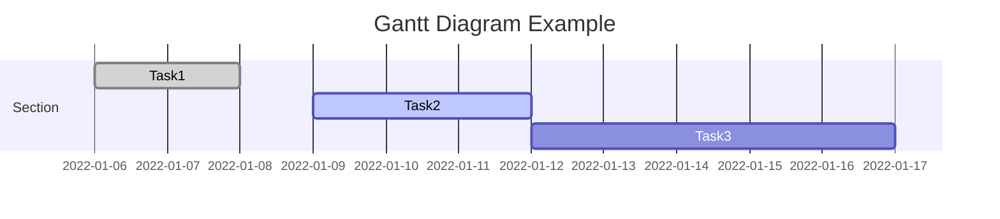
UAT-CHECK()

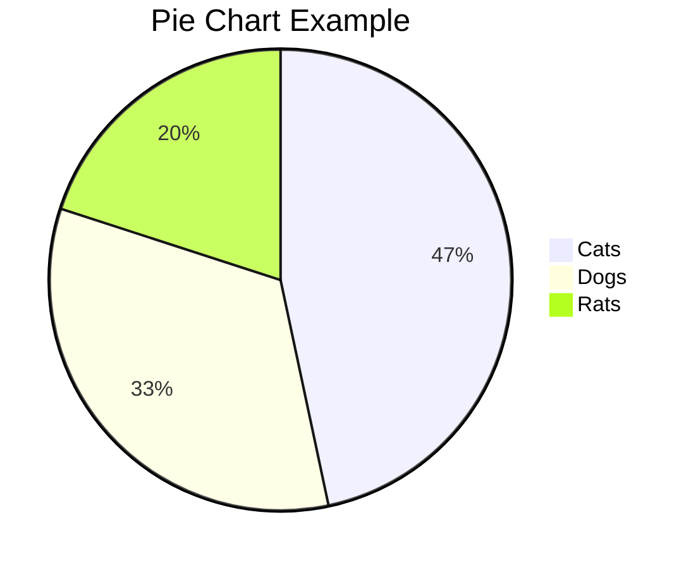
UAT-CHECK()

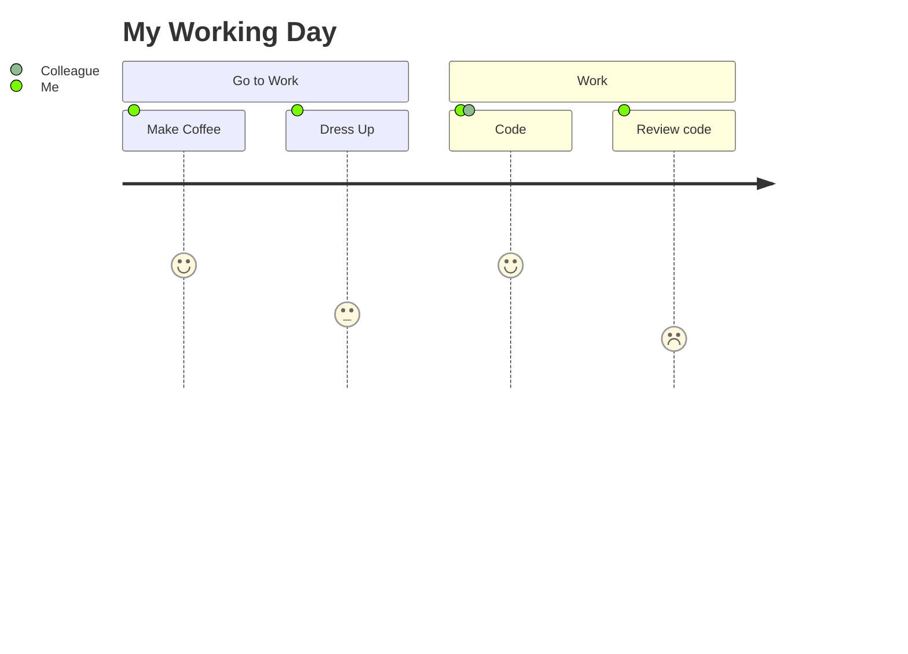
UAT-CHECK()

```mermaid
requirementDiagram
    requirement req1 {
      id: 1
      text: The system shall be secure
    }
    requirement req2 {
      id: 2
      text: The system shall be fast
    }
    req1 - priority:high -> req2


```
UAT-CHECK()

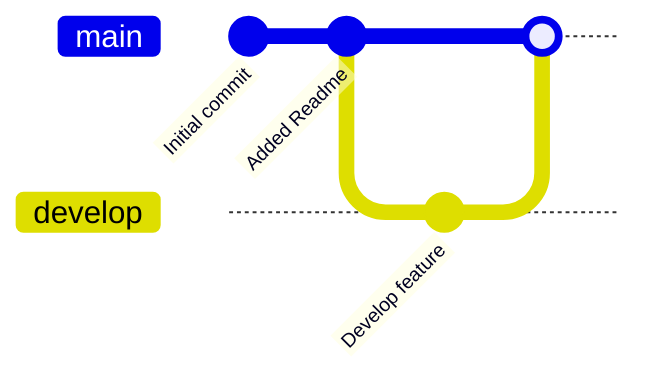
UAT-CHECK()


~~~js
console.log("Tilde fence, GFM");
~~~ 
UAT-CHECK()

<pre>
* GFM allows HTML *in text*
</pre> 
UAT-CHECK()

- [] Missing space after bracket for checkbox (invalid) 
UAT-CHECK()
- [x]Task missing space after checkbox (invalid) 
UAT-CHECK()
- [*] Not valid GFM (should not check) 
UAT-CHECK()

~not strikethrough~ (single tilde, not valid) 
UAT-CHECK()
~~GFM strikethrough~~ (valid) 
UAT-CHECK()
foo~~bar~~baz (strikethrough in middle of word) 
UAT-CHECK()

<!--
UAT for Issue #24: Autolinks – Hide angle brackets for URLs and email addresses in GFM.

Test the following:
- Autolink angle brackets are hidden when not selected.
- Link is clickable (http(s) → browser, email → mailto).
- When selected, angle brackets and raw markdown show.
- Only true autolinks affected, not normal brackets/text.
- Multiple/adjacent autolinks work.
-->

## Autolink URL (GFM)

<https://example.com>
UAT-CHECK()

<http://example.com/path?query=1&other=2>
UAT-CHECK()

Some text before <https://www.github.com> and after.
UAT-CHECK()

<https://example.com> <https://github.com> — two in a row!
UAT-CHECK()

Start<https://a.co>End (touching words)
UAT-CHECK()

Parenthetical (<https://inside-parentheses.com>)
UAT-CHECK()

## Autolink Email

<user@example.com>
UAT-CHECK()

<user+plus@example.com>
UAT-CHECK()

Contact: <firstname.lastname@domain.priv>
UAT-CHECK()

## Mixed Content: Only Autolinks Affected

Here is `<not a link>` and <https://really.a/link>.
UAT-CHECK()

Email: <example@site.com>, also see <https://site.com/docs>.
UAT-CHECK()

This should NOT hide: 5 < 7 and > should render as math/comparisons.
UAT-CHECK()

## Selection: Reveal Raw

(Manual UAT)
- Place cursor on or select each autolink above: angle brackets should appear (raw markdown shown).
- Deselect or move cursor out: brackets disappear, rendering returns to nice clickable link.

## Edge: Multiple in Same Paragraph

See <https://one.com> and <https://two.org> in a sentence.
UAT-CHECK()

Emails: <a@example.com> or <b@example.com> for support.
UAT-CHECK()

## Edge: Non-autolink Brackets Must Not Hide

Angle brackets not in autolink:
- <b>some html</b>
- 3 < 4 and 5 > 4
UAT-CHECK()

## Edge: In List & Blockquote

- Site 1: <https://one.org>
- Site 2: <https://two.org>
UAT-CHECK()

> Refer: <reference@example.com>
UAT-CHECK()

## Edge: Inline code should NOT trigger

`<https://not-autolink.com>`
UAT-CHECK()

`<user@example.com>`
UAT-CHECK()

## Edge: Email with dash, underscore, period, plus

<first.last_test+xyz-123@sub.domain.example.co.uk>
UAT-CHECK()

<!--
csforbes: Demonstrating correct rendering of explicit [title](mailto:email) markdown links.
Goal: These should display and behave as standard markdown links, *not* as autolinks in angle brackets.
Use case: He wants clickable "mailto:" or web links for collaborators using regular markdown renderers. 
-->

## Edge: Explicit [title](mailto:email) links must render as normal markdown

Example visual comparison:

Raw markdown:
```
<https://github.com>  
[GitHub](https://github.com)  
<bob@email.com>  
[Bob Email](mailto:bob@email.com)  
[bob@email.com](mailto:bob@email.com)
```

Rendered output:

<https://github.com>  
[GitHub](https://github.com)  
<bob@email.com>  
[Bob Email](mailto:bob@email.com)  
[bob@email.com](mailto:bob@email.com)

---

Email: [bob@email.com](mailto:bob@email.com)
UAT-CHECK()
// Expectation: The text "bob@email.com" should be shown as a regular clickable markdown link, *not* as an autolink in angle brackets. The link should use a mailto: scheme and should not reveal or hide any angle brackets on selection.

Multiple links: [alice@email.com](mailto:alice@email.com), [website](https://site.com)
UAT-CHECK()
// Expectation: Both "alice@email.com" and "website" are standard markdown links (one mailto, one web). Both should render as normal blue clickable links, with no angle brackets appearing or hiding on interaction.

- Use [support@service.test](mailto:support@service.test) to contact us.
UAT-CHECK()
// Expectation: The "support@service.test" address in the list item should appear as a standard markdown mailto link. No autolinking, no angle bracket display or disappearance on selection.

> Contact: [team@acme.org](mailto:team@acme.org)
UAT-CHECK()
// Expectation: Inside the blockquote, "team@acme.org" should be a normal mailto link, styled per markdown rules. No angle brackets; behaves like a standard blockquote link.
